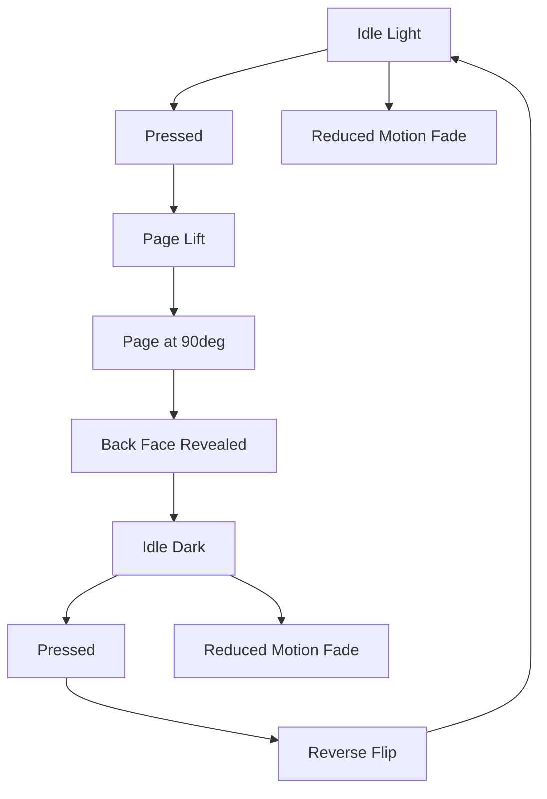
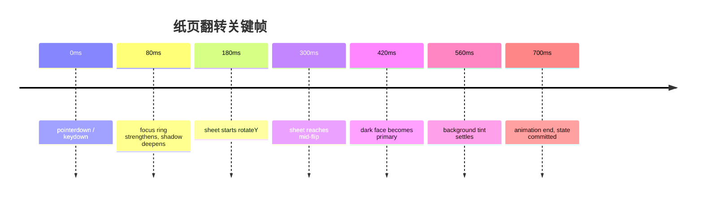
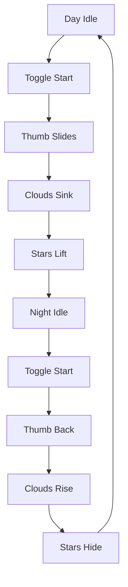
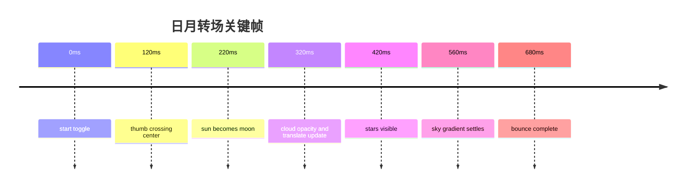
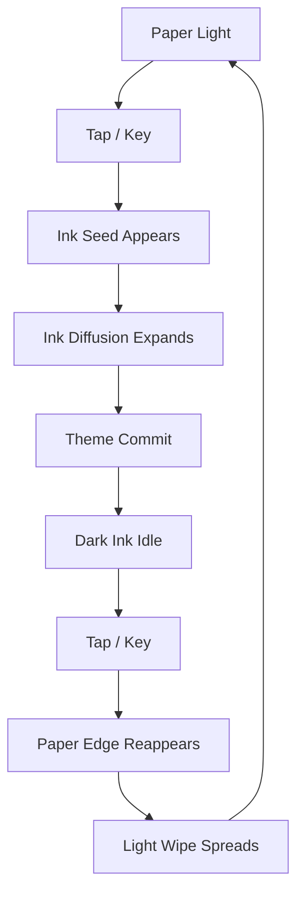
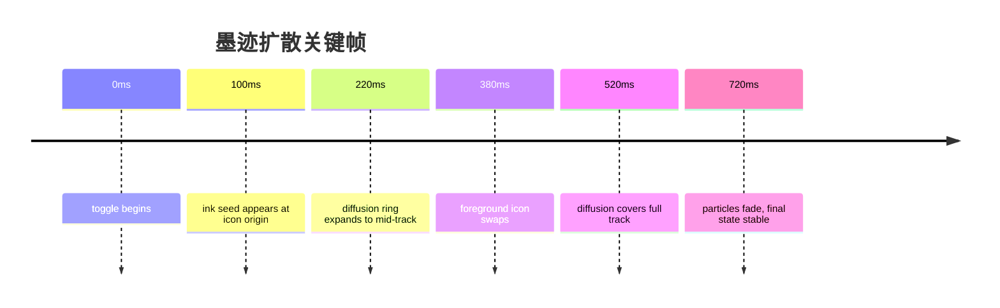

# Day-night-toggle-button 深度研究与 LightMark 适配方案

## 执行摘要

这个仓库不是一个单一、可直接安装到现代前端框架里的组件库，而更像一个“日夜切换按钮作品集”：根目录同时放了早期的纯 HTML/CSS/JS 演示版、后来的 Web Component 版、两个 Chrome 插件包装、一个 npm 重打包版本、一个精简版，以及截图与许可证文件。默认分支是 `master`，根目录没有 `vite.config.*`、`tsconfig.*`、`package-lock.json`、`pnpm-lock.yaml` 这类现代工程化文件，因此它本质上不是 Vue/Tauri 工程，而是以浏览器原生运行和展示为主。citeturn1view0turn17view0turn43view0

就“可复用性”而言，最值得借鉴的不是 1.0/2.0 的 DOM 直改式脚本，而是 3.0、4.0 和 npm 包中的 Web Component 方向：它们把切换器收敛为 `<theme-button>` 或导出的 `DayNightToggleButton` 类，支持 `value`、`size` 属性，并通过 `CustomEvent("change", { detail })` 抛出主题变化，同时监听 `matchMedia("(prefers-color-scheme: dark)")` 的变化以跟随系统主题。这个思路与 LightMark 的 Vue 组件封装最接近。citeturn23view0turn24view0turn28view0turn29view0turn45view3turn48view0turn49view0turn49view1

从实现机制看，主视觉几乎全靠 HTML `div` + CSS 阴影/渐变/圆角/`transform` 完成；主仓库的核心演示并不依赖 SVG，真正的 PNG 只出现在截图与浏览器插件图标里。换句话说，这个项目的“魔法”不是 SVG 法阵，而是一群非常勤奋的 `div`。对 LightMark 来说，这反而是好事：你可以非常容易地把视觉语义重构成主题 token、CSS 变量和 Vue `v-model`。citeturn15view0turn16view0turn16view3turn37view3turn17view0

许可方面，仓库根目录 LICENSE 采用 ISC，正文明确授予“use, copy, modify, and/or distribute ... for any purpose with or without fee”的权利；这意味着**允许商用**，包括闭源商用，但前提是保留原始版权声明和许可声明。OSI 的 ISC 许可证页面与 Choose a License 对 ISC 的说明，也都把它归为宽松型许可证，并明确列出商业使用、分发、修改、私用为允许项。citeturn46view0turn47search1turn47search9turn47search11

下面的结论可以先给你一个落地判断：如果你要把这个仓库“直接搬进” LightMark，我不建议原样嵌入 1.0/2.0 或插件脚本；我建议把 3.0/4.0 的**组件边界**和 1.0/2.0/精简版的**视觉语汇**抽出来，重写成 Vue 3 + TypeScript SFC，并把主题切换改成 `v-model + CSS variables + ARIA switch + prefers-reduced-motion` 的组合。这样既保留动画神韵，又不会把 LightMark 变成“靠 `document.querySelectorAll` 祈祷驱动”的应用。citeturn18view0turn22view0turn23view0turn24view0turn33view0turn49view2turn49view3turn49view4turn49view5

## 仓库源码审读

### 整体结构与技术判断

根目录可以分成九类内容：许可证与项目说明、1.0 演示、2.0 演示、3.0 演示、4.0 演示、Chrome 插件、Chrome 插件百度版、npm 包、精简版，以及截图资源。README 说明了“已迭代三版”、新增浏览器插件、以及 npm 包的存在；目录树也显示这些并列目录同时存在。citeturn17view0turn1view0

从演进路线看，仓库大致经历了三步：  
一是 1.0/2.0 的**页面内原生 DOM 演示**，核心特征是全局查询、直接改样式、依赖鼠标事件。二是 3.0/4.0 的**原生 Web Component 封装**，把可复用边界从页面收回到自定义元素内部，并引入 `change` 事件与系统主题监听。三是 npm 包与精简版：前者是 3.0 思路的再打包导出，后者则把更多交互逻辑转移回 CSS 状态选择器与 `[data-theme]`。citeturn18view0turn22view0turn23view0turn24view0turn45view3turn33view0turn34view0turn34view3

运行依赖也很清楚：1.0/2.0/精简版只需要现代浏览器；3.0/4.0 与 npm 包需要支持 Custom Elements、Shadow DOM、`CustomEvent`、`matchMedia`；插件目录依赖 Chrome Extension Manifest V3 的 `service_worker`、`chrome.scripting`、`chrome.tabs` 与 `chrome.storage`。仓库本身没有 Vue、TypeScript、Tauri 或构建器依赖，因此任何接入 LightMark 的工作，都是**移植**而不是“直接导入”。citeturn37view3turn39view1turn45view3turn48view0turn49view0

### 组件结构、CSS 与 JS 交互

1.0 的 `index.html` 构造了一个完整的场景树：`components` 外壳内含 `main-button`、三层 `daytime-backgrond` 虚影、`cloud`、`cloud-light`、`stars` 以及由多个 `star-son`、`cloud-son`、`moon` 节点组成的细部元素。CSS 通过圆形 `div`、阴影、渐变与 `transition-timing-function` 来模拟太阳、月亮、云层与星星；JS 则在点击与 hover 时直接改 `transform`、`backgroundColor`、`boxShadow`、`opacity` 与 `document.body.style.backgroundColor`。此外，1.0 还用递归 `setTimeout` 触发星星闪烁，并在 `DOMContentLoaded` 后用 `setInterval` 让云朵碎片做随机位移。citeturn15view0turn16view0turn16view1turn16view3turn16view4turn16view5turn18view0turn14view5turn14view6

2.0 的 HTML 结构与 1.0 基本同源，但星星数量更少，且更多闪烁逻辑转移到了 CSS `@keyframes star`。JS 仍然沿用 `isMoved`、`isClicked` 两个布尔状态和 `click`/`mousemove`/`mouseout` 三类事件，不过 hover 时不再只推按钮本体，还会显式调整每颗星星的位置与每朵云的 `right`/`bottom`，形成“外扩”效果。值得注意的是，2.0 脚本末尾出现了 `openOrCloseTime(cloudTimer)` 调用，但在已审阅文件中没有对应定义；如果直接运行原文件，这一段更像是未完成或遗留的实验代码。citeturn30view0turn19view1turn22view0turn31view0turn31view1

3.0/4.0 的 `index.html` 都已经非常轻：页面本身只放一个 `<theme-button value="dark" id="btn" size="3"></theme-button>`，再通过监听 `change` 事件改页面背景。真正的组件结构、样式和行为全部收进 `js/script.js`：脚本定义 `ThemeButton extends HTMLElement`，在 `connectedCallback` 中 `attachShadow({ mode: "closed" })`，用 `container.innerHTML` 注入内部 DOM，再用 `style.textContent` 注入全部样式，最后用 `CustomEvent("change", { detail })` 对外发出主题切换。它还通过 `window.matchMedia("(prefers-color-scheme: dark)")` 与 `change` 事件，跟随系统配色变化。4.0 与 3.0 的核心脚本基本等价，4.0 主要是 demo 页面元信息更完整。citeturn26view0turn26view1turn23view0turn24view0turn28view0turn29view0turn48view0turn49view0turn49view1

精简版则走了另一条路线：JS 只有 8 行，职责只是切换 `document.body.dataset.theme`；真正的日/夜视觉、hover 位移、星星闪烁和云层变化，主要都被写进 CSS 选择器，例如 `[data-theme="dark"]` 与 `.main-button:hover ~ ...` 这样的组合器规则。它比 1.0/2.0 更适合框架化移植，因为状态已经被“抽象成一个布尔属性”，而不是散落在大量 imperative DOM 写操作里。citeturn33view0turn33view2turn34view0turn34view1turn34view3

插件目录本质上是“把按钮变成浏览器注入工具”的包装。标准插件的 `manifest.json` 使用 MV3，声明 `service_worker`、`storage`、`activeTab`、`scripting` 权限，并把 `button.html` 暴露为 `web_accessible_resources`。`popup.js` 在点击“加入按钮”后，先把 `button.html` 注入当前活动页，再注入 `button.js`；而 `button.js` 不只运行切换器本身，还会粗粒度地遍历页面内的 `div`、`a`、`p`、`span` 改颜色。这种“全页强刷”对浏览器扩展是能工作的，但对 LightMark 这样的编辑器应用风险很高，因为它会绕过设计系统、语义层与组件边界。citeturn37view3turn39view1turn38view0turn40view0turn39view0

npm 包目录是对 Web Component 版的再导出。`package.json` 指向 `main: "index.js"`、声明 `license: "ISC"`，没有任何运行时依赖；README 说明它在撰写时仍然建议本地安装，并示例了 `customElements.define("toggle-button", DayNightToggleButton)` 的使用方式。`index.js` 最终 `export default DayNightToggleButton`，类构造器里完成 Shadow DOM 注入与主题切换逻辑，因此它更像“单文件原生组件模块”，而不是一个现代 npm 包生态里完整的构建产物。citeturn43view0turn44view1turn45view2turn45view3

### 文本与代码文件逐项表

下表聚焦**文本/代码/样式/配置文件**；纯 PNG 资源放在后面的资源清单里。由于 GitHub 网页输出对少数超长 raw 文件会折叠内容，我对这些文件按文件页、raw 内容和目录结构做了交叉审读，并在“检查行”列给出最值得先看的位置。  

| 路径 | 作用 | 关键函数 / 类 / 状态 | 检查行 |
|---|---|---|---|
| `README.md` | 根说明文档；给出版本演进、插件与截图说明 | 目录入口、截图文件名、插件使用方法 | `L0` citeturn17view0 |
| `LICENSE` | 根许可证，ISC | 商用授权、保留声明、免责条款 | `L268-L289` citeturn46view0 |
| `白天黑夜切换按钮1.0/index.html` | 原始场景 DOM 树 | `components`、`main-button`、`cloud`、`stars` | `L461-L675` citeturn15view0turn14view1 |
| `白天黑夜切换按钮1.0/css/style.css` | 1.0 全部视觉样式 | `.components`、`.main-button`、`.moon`、`.daytime-backgrond`、`.cloud-son`、`.star` | `L888-L916`、`L919-L939`、`L960-L1011`、`L1068-L1094`、`L1205-L1400` citeturn16view0turn16view1turn16view3turn16view4turn16view5 |
| `白天黑夜切换按钮1.0/js/script.js` | 1.0 交互脚本 | `$` 选择器、`isMoved`、`isClicked`、`twinkleStars()`、`moveElementRandomly()` | `raw L0`，以及 `L667-L834` 附近 citeturn18view0turn14view5turn14view6 |
| `白天黑夜切换按钮2.0/index.html` | 2.0 场景 DOM 树 | 结构与 1.0 同源，但星星更少 | `L401-L559` citeturn30view0 |
| `白天黑夜切换按钮2.0/css/style.css` | 2.0 样式与动画 | `@keyframes star`、hover 外扩位移 | `raw L0` citeturn19view1 |
| `白天黑夜切换按钮2.0/js/script.js` | 2.0 交互脚本 | 星星外扩、云层外扩、`cloudTimer` | `raw L0`，`L1167-L1176` 关注未定义调用 citeturn22view0turn31view0turn31view1 |
| `白天黑夜切换按钮3.0/index.html` | 3.0 demo 页面 | `<theme-button>`、`btn.addEventListener("change")` | `L290-L341` citeturn26view0 |
| `白天黑夜切换按钮3.0/js/script.js` | 3.0 核心 Web Component | `ThemeButton`、`CustomEvent("change")`、`matchMedia`、Shadow DOM | `raw L0-L1` citeturn23view0turn24view0 |
| `白天黑夜切换按钮4.0/index.html` | 4.0 demo 页面 | 与 3.0 同型，页面元信息更完整 | `L287-L340` citeturn26view1 |
| `白天黑夜切换按钮4.0/js/script.js` | 4.0 核心 Web Component | 与 3.0 近乎同构 | `raw L0-L1` citeturn28view0turn29view0 |
| `白天黑夜切换按钮chrome插件/manifest.json` | 标准 Chrome 插件配置 | MV3、`service_worker`、`scripting`、`default_popup` | `L300-L358` citeturn37view3 |
| `白天黑夜切换按钮chrome插件/background.js` | 插件后台初始化 | `chrome.runtime.onInstalled` | `raw L0` citeturn39view0 |
| `白天黑夜切换按钮chrome插件/popup.html` | 插件弹窗 UI | `toggleButton`、“加入按钮”入口 | `L317-L357` citeturn42view0turn42view3 |
| `白天黑夜切换按钮chrome插件/popup.css` | 插件弹窗样式 | `.module`、hover、输入区预留样式 | `L395-L526` citeturn42view1turn42view2 |
| `白天黑夜切换按钮chrome插件/popup.js` | 插件注入脚本 | `chrome.tabs.query`、`fetch(button.html)`、`chrome.scripting.executeScript` | `raw L0` citeturn39view1 |
| `白天黑夜切换按钮chrome插件/button.html` | 被注入页面的宿主 HTML | `<theme-button value="dark" id="btn" size="3">` | `L240-L242` citeturn41view0 |
| `白天黑夜切换按钮chrome插件/button.js` | 被注入页面的组件与整页改色逻辑 | 全页节点改色、`ThemeButton` 内联定义 | `raw L0-L1` citeturn38view0turn40view0 |
| `白天黑夜切换按钮chrome插件(百度版)/manifest.json` | 百度版插件配置 | 与标准插件 manifest 同型 | `L300-L353` citeturn50view0 |
| `白天黑夜切换按钮chrome插件(百度版)/background.js` | 百度版插件后台初始化 | 与标准插件同型初始化脚本 | 文件页与 raw 已核对 citeturn50view1turn51view1turn52view2 |
| `白天黑夜切换按钮chrome插件(百度版)/button.js` | 百度版注入脚本 | 与标准插件平行，但脚本体量更大，说明包含更多目标页适配 | 文件页与 raw 已核对 citeturn50view2turn51view0turn52view0turn52view1 |
| `白天黑夜切换按钮chrome插件(百度版)/popup.js` | 百度版弹窗脚本 | 与标准插件同型注入流程 | 文件页与 raw 已核对 citeturn50view3turn51view2turn52view3 |
| `白天黑夜切换按钮npm包/package.json` | npm 包元信息 | `main`、`license`、零依赖 | `L258-L278` citeturn43view0 |
| `白天黑夜切换按钮npm包/index.js` | npm 包主入口 | `DayNightToggleButton extends HTMLElement`、`export default` | `L686-L701`、`L1026-L1065` citeturn44view0turn45view2turn45view3 |
| `白天黑夜切换按钮npm包/README.md` | npm 使用说明 | 本地安装、`customElements.define` 示例 | `L238-L261` citeturn44view1 |
| `白天黑夜切换按钮精简版/index.html` | 精简版宿主页面 | 引入 CSS/JS，承载简化场景树 | `L399-L549` citeturn32view0turn34view4 |
| `白天黑夜切换按钮精简版/js/script.js` | 精简版脚本 | `data-theme` 切换、`TOGGLE()` | `L254-L267` citeturn33view0 |
| `白天黑夜切换按钮精简版/js/style.css` | 精简版核心样式 | `[data-theme="dark"]`、hover 组合器、`@keyframes naoStar/naoCloud` | `L3415-L3596`、`L3775-L3811` 等处 citeturn34view0turn34view1turn34view3 |
| `白天黑夜切换按钮精简版/README.md` | 精简版说明 | CodePen 预览、iOS 星星修复说明 | `L238-L249` citeturn33view2 |

### 纯资源文件清单

根 README 引用了 `screenshots/day.png`、`screenshots/night.png`、`screenshots/version.png` 以及 `screenshots/ExtensionProgram1.png` 到 `ExtensionProgram5.png` 作为视觉展示。两个插件目录的 `manifest.json` 都引用了 `images/get_started16.png`、`32.png`、`48.png`、`128.png` 这四个图标文件。对 LightMark 迁移来说，这些 PNG 都不是运行必需资源，只是文档截图和插件图标；真正的主题切换视觉来自 DOM/CSS，而不是位图贴图。citeturn17view0turn37view3turn50view0

## LightMark 可复用 API 抽象

### 抽象原则与假设

下面的 API 不是仓库原样接口，而是**针对 LightMark 重构后的组件接口**。我明确采用这些假设：  
其一，LightMark 使用 Vue 3 + TypeScript；其二，构建链默认按 Vite 思维处理，因为原仓库没有提供 bundler 配置；其三，Tauri 的系统深浅色同步由外层状态或桥接层提供 `systemMode`，而不是在组件内部直接调用平台 API；其四，动画应当兼容键盘、屏幕阅读器和 `prefers-reduced-motion`。原仓库里真正已经证明可复用的接口思想，主要来自 3.0/4.0/npm 包中的 `value`、`size`、`change` 事件与系统主题监听。citeturn23view0turn24view0turn28view0turn29view0turn45view3turn49view2turn49view3turn49view4turn49view5

### 建议的统一组件接口

```ts
type ThemeMode = 'light' | 'dark'
type ToggleSource = 'click' | 'keyboard' | 'system' | 'programmatic'

interface LightMarkThemeToggleProps {
  modelValue: boolean                 // true = dark, false = light
  disabled?: boolean                  // 是否禁用
  label?: string                      // ARIA / 可访问标签
  size?: 'sm' | 'md' | 'lg' | number  // 预设尺寸或像素宽度
  duration?: number                   // 动画时长，毫秒
  followSystem?: boolean              // 是否跟随系统主题
  systemMode?: ThemeMode | null       // 外层注入的系统主题
  reducedMotion?: boolean | null      // null = 跟随 prefers-reduced-motion
  themeClass?: string                 // 给 LightMark 主题系统加额外类名
}
```

```ts
interface LightMarkThemeToggleEmits {
  (e: 'update:modelValue', value: boolean): void
  (e: 'change', payload: {
    mode: ThemeMode
    source: ToggleSource
  }): void
}
```

```ts
interface LightMarkThemeToggleSlots {
  label?: () => VNode[]        // 自定义文字标签
  lightIcon?: () => VNode[]    // 白天/浅色图标替换
  darkIcon?: () => VNode[]     // 夜间/深色图标替换
}
```

### 建议暴露的 CSS 变量

| 变量名 | 默认语义 | 用途 |
|---|---|---|
| `--lm-toggle-width` | 组件宽度 | 根容器宽 |
| `--lm-toggle-height` | 组件高度 | 根容器高 |
| `--lm-toggle-radius` | 圆角半径 | 轨道外形 |
| `--lm-toggle-duration` | 动画时长 | 统一过渡时间 |
| `--lm-toggle-ease` | 缓动曲线 | 统一过渡曲线 |
| `--lm-color-paper` | 浅色纸面 | 纸张/浅色面 |
| `--lm-color-ink` | 深色墨面 | 墨迹/深色面 |
| `--lm-color-sky` | 浅色背景 | 日间轨道背景 |
| `--lm-color-night` | 夜间背景 | 深色轨道背景 |
| `--lm-color-accent` | 强调色 | 环、折角、光晕 |
| `--lm-shadow-color` | 阴影色 | 阴影与体积感 |
| `--lm-focus-ring` | 焦点色 | 键盘焦点外环 |

### 建议维护的内部状态

| 状态名 | 类型 | 说明 |
|---|---|---|
| `isDark` | `Ref<boolean>` | 当前组件状态，驱动视觉分支 |
| `isAnimating` | `Ref<boolean>` | 是否处于动画期，防止连击穿透 |
| `prefersReducedMotion` | `Ref<boolean>` | 来自 `prefers-reduced-motion` |
| `mql` | `MediaQueryList \| null` | `matchMedia` 对象，用于监听变化 |
| `lastSource` | `ToggleSource` | 最近一次切换来源，便于统计与日志 |
| `isFocusedVisible` | `Ref<boolean>` | 焦点可见态，可用于 focus ring |

这个 API 与原仓库最大的差异，是把“散落在 DOM style 上的即时修改”收敛成**单一状态 + 受控输入/输出**。原仓库 1.0/2.0 的 `isMoved` / `isClicked` 很适合做内部瞬时状态，但不适合作为应用层主题真相来源；LightMark 里真正的主题真相应当是 store 或 `v-model`，组件只做视图和交互。3.0/4.0 的 `change` 事件思路是可以保留的，只是把原生 `CustomEvent.detail` 翻译成 Vue emit 更自然。citeturn18view0turn22view0turn23view0turn24view0turn45view3turn48view0

## LightMark 动画方案

### 纸页翻转

纸页翻转最适合 LightMark，因为它把“主题切换”直接转译成“编辑器载体的材质切换”：从暖白纸页翻到深墨页，用户会更容易把它理解成“阅读环境变化”，而不是单纯的 UI 开关。所需资产可以做到**纯 CSS + 可选 inline SVG 图标**：主体用按钮、纸页、折角、纸纹线条；JS 只负责切换状态，不负责位移细节；SVG 仅建议用于可替换的书页角标，不是必须。这个方案与仓库里 3.0/4.0“组件边界清晰”的封装方向兼容，但视觉语义更贴近编辑器。citeturn23view0turn24view0turn28view0turn29view0

动画时序建议如下：按下时焦点环与阴影增强；`0ms-180ms` 纸页开始抬起并形成轻微透视；`180ms-420ms` 纸页翻过中线，正背面互换；`420ms-700ms` 背景从暖纸色切到墨色，折角与纸纹淡出，新的深色前景稳定；若用户启用 reduced motion，则直接做背景与图标淡变，不做 3D 翻页。对交互来说，它应支持 `Space` 必选、`Enter` 可选，使用 `role="switch"`、稳定不变的 accessible label，以及 `aria-checked` 表示开关状态。citeturn49view2turn49view3turn49view4turn49view5





### 日月转场

日月转场是对原仓库精神最忠实的现代化版本：太阳、月亮、星星、云层和天空轨道都可以保留，但要把 1.0/2.0 那种“直接写 style 字符串”的方式改成状态驱动 CSS。资产仍然可以是**纯 CSS 图元**：圆形、渐变、内阴影、径向渐变星星；不必依赖 SVG。所需 JS 很少，只要处理点击、键盘和系统主题同步即可。citeturn15view0turn16view1turn16view3turn16view5turn18view0turn23view0turn24view0

建议时间线是：`0ms-120ms` 按钮开始横向移动；`120ms-260ms` 太阳缩亮并向月亮灰色过渡；`220ms-420ms` 云层下沉、星星上浮；`420ms-680ms` 夜空/日空背景完成渐变切换，并留一个轻微回弹结束。若 reduced motion 开启，则保留按钮位置、颜色和少量透明度变化，禁用星星/云朵的浮动与扩散动画。和纸页翻转一样，它应使用 switch 语义与键盘触发。原仓库 3.0/4.0 实际已经验证了 `matchMedia("(prefers-color-scheme: dark)")` 监听用户系统模式的模式，这一点可以直接吸收。citeturn23view0turn24view0turn28view0turn29view0turn49view0turn49view1turn49view2turn49view3turn49view4turn49view5





### 墨迹扩散擦除

墨迹扩散擦除是最“LightMark 品牌化”的方案。它不模仿实体开关，而是模仿记号笔或墨水在纸上漫开的感觉：深色模式像墨水铺开，浅色模式像纸白重新浮现。推荐资产是**CSS + 可选一枚非常小的 inline SVG 墨滴图标**；主扩散可以用 `clip-path: circle()`、`transform: scale()` 或 radial-gradient mask 完成。JS 仍只负责状态切换与 reduced motion 分支，不负责逐帧渲染。  

这个方案的优点是品牌感强，缺点是如果大量使用 `filter: blur()` 和复杂蒙版，可能比前两个方案更吃重绘。因此建议把主体扩散限制在组件内部的少量绝对定位层，避免把墨迹“抹”到整个编辑器；如果用户选择 reduced motion，直接退化为颜色溶解与边框变换，不做扩散波纹。可访问性规则仍然完全沿用 WAI switch 模式。关于 reduced motion，MDN 明确建议在用户请求减少动画时改用更温和、非前庭触发型的替代表现。citeturn49view2turn49view3turn49view4turn49view5





## Vue 3 与 TypeScript 组件实现

下面三份 SFC 都遵循相同思路：  
使用 `v-model` 管理深浅色真相、`change` 发出结构化事件、`followSystem + systemMode` 对接外层系统主题、`prefers-reduced-motion` 做动画降级，并用 `role="switch"` / `aria-checked` 满足可访问性要求。ARIA 键盘与状态语义参考 WAI APG，系统主题监听与 reduced motion 行为参考 MDN。citeturn49view0turn49view1turn49view2turn49view3turn49view4turn49view5

### 纸页翻转组件

```vue
<!-- LmThemeTogglePageFlip.vue -->
<script setup lang="ts">
import { computed, onBeforeUnmount, onMounted, ref, watch } from 'vue'

type ThemeMode = 'light' | 'dark'
type ToggleSource = 'click' | 'keyboard' | 'system' | 'programmatic'

const props = withDefaults(defineProps<{
  modelValue: boolean
  disabled?: boolean
  label?: string
  width?: number
  duration?: number
  followSystem?: boolean
  systemMode?: ThemeMode | null
  reducedMotion?: boolean | null
}>(), {
  disabled: false,
  label: '切换主题',
  width: 112,
  duration: 720,
  followSystem: false,
  systemMode: null,
  reducedMotion: null,
})

const emit = defineEmits<{
  'update:modelValue': [value: boolean]
  'change': [payload: { mode: ThemeMode; source: ToggleSource }]
}>()

const isDark = ref(props.modelValue)
const isAnimating = ref(false)
const prefersReducedMotion = ref(false)
let reducedMotionMql: MediaQueryList | null = null
let stopTimer: number | null = null

watch(() => props.modelValue, (value) => {
  isDark.value = value
})

watch(
  () => [props.followSystem, props.systemMode] as const,
  ([followSystem, systemMode]) => {
    if (!followSystem || !systemMode) return
    apply(systemMode === 'dark', 'system')
  },
  { immediate: true }
)

const motionDisabled = computed(() => {
  if (props.reducedMotion !== null) return props.reducedMotion
  return prefersReducedMotion.value
})

const rootStyle = computed(() => ({
  '--lm-toggle-width': `${props.width}px`,
  '--lm-toggle-height': `${Math.round(props.width * 0.52)}px`,
  '--lm-toggle-duration': `${motionDisabled.value ? 0 : props.duration}ms`,
}))

function clearAnimationTimer() {
  if (stopTimer !== null) {
    window.clearTimeout(stopTimer)
    stopTimer = null
  }
}

function apply(nextDark: boolean, source: ToggleSource) {
  if (props.disabled || nextDark === isDark.value) return
  isDark.value = nextDark
  emit('update:modelValue', nextDark)
  emit('change', { mode: nextDark ? 'dark' : 'light', source })

  if (motionDisabled.value) {
    isAnimating.value = false
    return
  }

  isAnimating.value = true
  clearAnimationTimer()
  stopTimer = window.setTimeout(() => {
    isAnimating.value = false
  }, props.duration)
}

function toggle(source: ToggleSource) {
  apply(!isDark.value, source)
}

function onKeydown(event: KeyboardEvent) {
  if (event.key === ' ' || event.key === 'Enter') {
    event.preventDefault()
    toggle('keyboard')
  }
}

onMounted(() => {
  reducedMotionMql = window.matchMedia('(prefers-reduced-motion: reduce)')
  prefersReducedMotion.value = reducedMotionMql.matches

  const onMotionChange = (event: MediaQueryListEvent) => {
    prefersReducedMotion.value = event.matches
  }

  reducedMotionMql.addEventListener?.('change', onMotionChange)
  onBeforeUnmount(() => {
    reducedMotionMql?.removeEventListener?.('change', onMotionChange)
  })
})

onBeforeUnmount(() => {
  clearAnimationTimer()
})
</script>

<template>
  <button
    class="lm-page-flip"
    :class="{ 'is-dark': isDark, 'is-animating': isAnimating }"
    :style="rootStyle"
    type="button"
    role="switch"
    :aria-checked="String(isDark)"
    :aria-label="label"
    :disabled="disabled"
    @click="toggle('click')"
    @keydown="onKeydown"
  >
    <span class="lm-spine" aria-hidden="true"></span>

    <span class="lm-sheet-shell" aria-hidden="true">
      <span class="lm-sheet">
        <span class="lm-face lm-face-front">
          <span class="lm-corner"></span>
          <span class="lm-lines">
            <i></i><i></i><i></i>
          </span>
          <span class="lm-sun-dot"></span>
        </span>

        <span class="lm-face lm-face-back">
          <span class="lm-moon-dot"></span>
          <span class="lm-stars">
            <i></i><i></i><i></i>
          </span>
        </span>
      </span>
    </span>

    <span class="lm-visually-hidden">{{ label }}</span>
  </button>
</template>

<style scoped>
.lm-page-flip {
  --lm-toggle-radius: calc(var(--lm-toggle-height) / 2);
  --lm-color-paper: #fff7e8;
  --lm-color-paper-line: rgba(120, 102, 73, 0.22);
  --lm-color-ink: #1c2230;
  --lm-color-night: #111827;
  --lm-color-sky: #f4ecdd;
  --lm-color-accent: #d3a85a;
  --lm-shadow-color: rgba(15, 23, 42, 0.18);
  --lm-focus-ring: rgba(82, 139, 255, 0.45);
  position: relative;
  inline-size: var(--lm-toggle-width);
  block-size: var(--lm-toggle-height);
  border: 0;
  border-radius: var(--lm-toggle-radius);
  background:
    linear-gradient(135deg, rgba(255,255,255,0.8), rgba(255,247,232,0.92));
  box-shadow:
    inset 0 1px 0 rgba(255,255,255,0.7),
    0 12px 28px var(--lm-shadow-color);
  cursor: pointer;
  transition:
    background var(--lm-toggle-duration) ease,
    box-shadow var(--lm-toggle-duration) ease,
    transform 160ms ease;
  isolation: isolate;
  overflow: hidden;
}

/* TODO: 将这些颜色变量映射到 LightMark 的主题 token。 */
.lm-page-flip:focus-visible {
  outline: none;
  box-shadow:
    0 0 0 4px var(--lm-focus-ring),
    0 12px 28px var(--lm-shadow-color);
}

.lm-page-flip:disabled {
  opacity: 0.56;
  cursor: not-allowed;
}

.lm-page-flip.is-dark {
  background:
    linear-gradient(135deg, #243143, var(--lm-color-night));
}

.lm-spine {
  position: absolute;
  inset-block: 12%;
  inset-inline-start: 8px;
  inline-size: 8px;
  border-radius: 999px;
  background: linear-gradient(180deg, #d0b58a, #8f6d3f);
  opacity: 0.85;
}

.lm-sheet-shell {
  position: absolute;
  inset: 6px 8px 6px 18px;
  perspective: 800px;
}

.lm-sheet {
  position: relative;
  inline-size: 100%;
  block-size: 100%;
  transform-style: preserve-3d;
  transform-origin: 8% 50%;
  transition: transform var(--lm-toggle-duration) cubic-bezier(.25, .8, .2, 1);
}

.lm-page-flip.is-dark .lm-sheet {
  transform: rotateY(-180deg);
}

.lm-face {
  position: absolute;
  inset: 0;
  display: block;
  border-radius: calc(var(--lm-toggle-radius) - 8px);
  backface-visibility: hidden;
  overflow: hidden;
}

.lm-face-front {
  background:
    linear-gradient(180deg, #fffaf0, var(--lm-color-paper));
  box-shadow:
    inset 0 0 0 1px rgba(191, 162, 113, 0.28),
    inset 0 -14px 24px rgba(232, 214, 182, 0.45);
}

.lm-face-back {
  transform: rotateY(180deg);
  background:
    linear-gradient(180deg, #243143, var(--lm-color-ink));
  box-shadow: inset 0 0 0 1px rgba(255,255,255,0.08);
}

.lm-corner {
  position: absolute;
  inset-block-start: 0;
  inset-inline-end: 0;
  inline-size: 18px;
  block-size: 18px;
  clip-path: polygon(0 0, 100% 0, 100% 100%);
  background: linear-gradient(135deg, rgba(255,255,255,0.85), rgba(227, 212, 186, 0.9));
}

.lm-lines {
  position: absolute;
  inset-inline: 14px 28px;
  inset-block-start: 12px;
  display: grid;
  gap: 6px;
}

.lm-lines i {
  display: block;
  block-size: 2px;
  border-radius: 999px;
  background: var(--lm-color-paper-line);
}

.lm-sun-dot,
.lm-moon-dot {
  position: absolute;
  inset-inline-end: 18px;
  inset-block-end: 12px;
  inline-size: 12px;
  block-size: 12px;
  border-radius: 999px;
}

.lm-sun-dot {
  background: radial-gradient(circle at 35% 35%, #fff3b0, #eab84d 70%);
  box-shadow: 0 0 12px rgba(234,184,77,0.45);
}

.lm-moon-dot {
  background: radial-gradient(circle at 65% 35%, #f2f5ff, #c8d1e7 70%);
  box-shadow: inset -3px -2px 0 rgba(111, 123, 158, 0.3);
}

.lm-stars {
  position: absolute;
  inset: 10px 12px auto auto;
  inline-size: 30px;
  block-size: 16px;
}

.lm-stars i {
  position: absolute;
  inline-size: 3px;
  block-size: 3px;
  border-radius: 999px;
  background: rgba(255,255,255,0.85);
}

.lm-stars i:nth-child(1) { top: 2px; left: 6px; }
.lm-stars i:nth-child(2) { top: 10px; left: 18px; }
.lm-stars i:nth-child(3) { top: 5px; left: 25px; }

.lm-visually-hidden {
  position: absolute;
  inline-size: 1px;
  block-size: 1px;
  padding: 0;
  margin: -1px;
  overflow: hidden;
  clip-path: inset(50%);
  white-space: nowrap;
  border: 0;
}
</style>
```

这个版本保留了原仓库“单一切换器容纳完整微场景”的思路，但把真实状态交给 Vue，同时把系统同步与可访问性做到组件级。citeturn23view0turn24view0turn49view2turn49view3turn49view4turn49view5

### 日月转场组件

```vue
<!-- LmThemeToggleSunMoon.vue -->
<script setup lang="ts">
import { computed, onBeforeUnmount, onMounted, ref, watch } from 'vue'

type ThemeMode = 'light' | 'dark'
type ToggleSource = 'click' | 'keyboard' | 'system' | 'programmatic'

const props = withDefaults(defineProps<{
  modelValue: boolean
  disabled?: boolean
  label?: string
  width?: number
  duration?: number
  followSystem?: boolean
  systemMode?: ThemeMode | null
  reducedMotion?: boolean | null
}>(), {
  disabled: false,
  label: '切换浅色与深色',
  width: 122,
  duration: 680,
  followSystem: false,
  systemMode: null,
  reducedMotion: null,
})

const emit = defineEmits<{
  'update:modelValue': [value: boolean]
  'change': [payload: { mode: ThemeMode; source: ToggleSource }]
}>()

const isDark = ref(props.modelValue)
const prefersReducedMotion = ref(false)
let mql: MediaQueryList | null = null

watch(() => props.modelValue, (value) => {
  isDark.value = value
})

watch(
  () => [props.followSystem, props.systemMode] as const,
  ([followSystem, systemMode]) => {
    if (!followSystem || !systemMode) return
    setValue(systemMode === 'dark', 'system')
  },
  { immediate: true }
)

const motionOff = computed(() => props.reducedMotion ?? prefersReducedMotion.value)
const rootStyle = computed(() => ({
  '--lm-toggle-width': `${props.width}px`,
  '--lm-toggle-height': `${Math.round(props.width * 0.52)}px`,
  '--lm-toggle-duration': `${motionOff.value ? 0 : props.duration}ms`,
}))

function setValue(nextDark: boolean, source: ToggleSource) {
  if (props.disabled || nextDark === isDark.value) return
  isDark.value = nextDark
  emit('update:modelValue', nextDark)
  emit('change', { mode: nextDark ? 'dark' : 'light', source })
}

function onKeydown(event: KeyboardEvent) {
  if (event.key === ' ' || event.key === 'Enter') {
    event.preventDefault()
    setValue(!isDark.value, 'keyboard')
  }
}

onMounted(() => {
  mql = window.matchMedia('(prefers-reduced-motion: reduce)')
  prefersReducedMotion.value = mql.matches
  const handler = (event: MediaQueryListEvent) => {
    prefersReducedMotion.value = event.matches
  }
  mql.addEventListener?.('change', handler)
  onBeforeUnmount(() => mql?.removeEventListener?.('change', handler))
})
</script>

<template>
  <button
    class="lm-sun-moon"
    :class="{ 'is-dark': isDark }"
    :style="rootStyle"
    type="button"
    role="switch"
    :aria-checked="String(isDark)"
    :aria-label="label"
    :disabled="disabled"
    @click="setValue(!isDark, 'click')"
    @keydown="onKeydown"
  >
    <span class="lm-sky"></span>
    <span class="lm-cloud lm-cloud-a"></span>
    <span class="lm-cloud lm-cloud-b"></span>

    <span class="lm-stars" aria-hidden="true">
      <i></i><i></i><i></i><i></i>
    </span>

    <span class="lm-thumb" aria-hidden="true">
      <span class="lm-crater crater-a"></span>
      <span class="lm-crater crater-b"></span>
      <span class="lm-crater crater-c"></span>
    </span>

    <span class="lm-visually-hidden">{{ label }}</span>
  </button>
</template>

<style scoped>
.lm-sun-moon {
  --lm-toggle-radius: calc(var(--lm-toggle-height) / 2);
  --lm-day-a: #8fd6ff;
  --lm-day-b: #dff6ff;
  --lm-night-a: #172033;
  --lm-night-b: #2f405f;
  --lm-sun: #ffcc4d;
  --lm-moon: #c6cfdf;
  --lm-focus-ring: rgba(82, 139, 255, 0.45);
  position: relative;
  inline-size: var(--lm-toggle-width);
  block-size: var(--lm-toggle-height);
  border: 0;
  border-radius: var(--lm-toggle-radius);
  background: linear-gradient(180deg, var(--lm-day-a), var(--lm-day-b));
  box-shadow:
    inset 0 0 0 1px rgba(255,255,255,0.35),
    inset 0 -10px 14px rgba(0,0,0,0.08),
    0 12px 24px rgba(15, 23, 42, 0.15);
  overflow: hidden;
  cursor: pointer;
  transition:
    background var(--lm-toggle-duration) ease,
    box-shadow var(--lm-toggle-duration) ease;
}

.lm-sun-moon:focus-visible {
  outline: none;
  box-shadow:
    0 0 0 4px var(--lm-focus-ring),
    0 12px 24px rgba(15, 23, 42, 0.18);
}

.lm-sun-moon.is-dark {
  background: linear-gradient(180deg, var(--lm-night-b), var(--lm-night-a));
}

.lm-sun-moon:disabled {
  opacity: 0.56;
  cursor: not-allowed;
}

.lm-sky {
  position: absolute;
  inset: 0;
}

.lm-cloud {
  position: absolute;
  inset-block-end: 6px;
  block-size: 16px;
  border-radius: 999px;
  background: rgba(255,255,255,0.86);
  filter: drop-shadow(0 2px 2px rgba(0,0,0,0.08));
  transition:
    transform var(--lm-toggle-duration) ease,
    opacity var(--lm-toggle-duration) ease;
}

.lm-cloud::before,
.lm-cloud::after {
  content: '';
  position: absolute;
  border-radius: 999px;
  background: inherit;
}

.lm-cloud-a {
  inset-inline-start: 16px;
  inline-size: 28px;
}
.lm-cloud-a::before { inline-size: 16px; block-size: 16px; left: 4px; top: -6px; }
.lm-cloud-a::after  { inline-size: 14px; block-size: 14px; right: 4px; top: -4px; }

.lm-cloud-b {
  inset-inline-start: 46px;
  inline-size: 24px;
  opacity: 0.9;
}
.lm-cloud-b::before { inline-size: 14px; block-size: 14px; left: 2px; top: -5px; }
.lm-cloud-b::after  { inline-size: 12px; block-size: 12px; right: 2px; top: -3px; }

.lm-sun-moon.is-dark .lm-cloud {
  transform: translateY(20px);
  opacity: 0;
}

.lm-stars {
  position: absolute;
  inset: 10px 10px auto auto;
  inline-size: 40px;
  block-size: 18px;
  opacity: 0;
  transform: translateY(-6px);
  transition:
    opacity var(--lm-toggle-duration) ease,
    transform var(--lm-toggle-duration) ease;
}

.lm-sun-moon.is-dark .lm-stars {
  opacity: 1;
  transform: translateY(0);
}

.lm-stars i {
  position: absolute;
  inline-size: 3px;
  block-size: 3px;
  border-radius: 999px;
  background: #fff;
  box-shadow: 0 0 8px rgba(255,255,255,0.45);
}

.lm-stars i:nth-child(1) { top: 1px; left: 4px; }
.lm-stars i:nth-child(2) { top: 10px; left: 14px; }
.lm-stars i:nth-child(3) { top: 4px; left: 25px; }
.lm-stars i:nth-child(4) { top: 11px; left: 34px; }

.lm-thumb {
  position: absolute;
  inset-block-start: 4px;
  inset-inline-start: 4px;
  inline-size: calc(var(--lm-toggle-height) - 8px);
  block-size: calc(var(--lm-toggle-height) - 8px);
  border-radius: 999px;
  background: radial-gradient(circle at 35% 35%, #fff0a8, var(--lm-sun) 70%);
  box-shadow:
    0 6px 12px rgba(0,0,0,0.18),
    inset -3px -4px 5px rgba(0,0,0,0.16),
    inset 4px 4px 5px rgba(255,255,255,0.45);
  transform: translateX(0);
  transition:
    transform var(--lm-toggle-duration) cubic-bezier(.25, .9, .2, 1),
    background var(--lm-toggle-duration) ease,
    box-shadow var(--lm-toggle-duration) ease;
}

.lm-sun-moon.is-dark .lm-thumb {
  transform: translateX(calc(var(--lm-toggle-width) - var(--lm-toggle-height)));
  background: radial-gradient(circle at 35% 35%, #f3f7ff, var(--lm-moon) 70%);
  box-shadow:
    0 6px 12px rgba(0,0,0,0.28),
    inset -3px -4px 5px rgba(60, 78, 112, 0.28),
    inset 4px 4px 5px rgba(255,255,255,0.25);
}

.lm-crater {
  position: absolute;
  border-radius: 999px;
  background: rgba(109, 124, 154, 0.35);
  opacity: 0;
  transition: opacity var(--lm-toggle-duration) ease;
}

.lm-sun-moon.is-dark .lm-crater {
  opacity: 1;
}

.crater-a { top: 9px; left: 20px; width: 8px; height: 8px; }
.crater-b { top: 20px; left: 8px; width: 12px; height: 12px; }
.crater-c { top: 26px; left: 24px; width: 7px; height: 7px; }

.lm-visually-hidden {
  position: absolute;
  inline-size: 1px;
  block-size: 1px;
  padding: 0;
  margin: -1px;
  overflow: hidden;
  clip-path: inset(50%);
  white-space: nowrap;
  border: 0;
}

/* TODO: 外层可把 systemMode 绑定到 Tauri 返回的系统主题值。 */
</style>
```

这个组件是对仓库主视觉的“Vue 化、令牌化、语义化”改写；保留日月与云星语汇，但去掉了全局 DOM 直改。citeturn18view0turn22view0turn23view0turn24view0

### 墨迹扩散擦除组件

```vue
<!-- LmThemeToggleInkDiffusion.vue -->
<script setup lang="ts">
import { computed, onBeforeUnmount, onMounted, ref, watch } from 'vue'

type ThemeMode = 'light' | 'dark'
type ToggleSource = 'click' | 'keyboard' | 'system' | 'programmatic'

const props = withDefaults(defineProps<{
  modelValue: boolean
  disabled?: boolean
  label?: string
  width?: number
  duration?: number
  followSystem?: boolean
  systemMode?: ThemeMode | null
  reducedMotion?: boolean | null
}>(), {
  disabled: false,
  label: '切换阅读主题',
  width: 118,
  duration: 720,
  followSystem: false,
  systemMode: null,
  reducedMotion: null,
})

const emit = defineEmits<{
  'update:modelValue': [value: boolean]
  'change': [payload: { mode: ThemeMode; source: ToggleSource }]
}>()

const isDark = ref(props.modelValue)
const prefersReducedMotion = ref(false)
let mql: MediaQueryList | null = null

watch(() => props.modelValue, (value) => {
  isDark.value = value
})

watch(
  () => [props.followSystem, props.systemMode] as const,
  ([followSystem, systemMode]) => {
    if (!followSystem || !systemMode) return
    commit(systemMode === 'dark', 'system')
  },
  { immediate: true }
)

const motionOff = computed(() => props.reducedMotion ?? prefersReducedMotion.value)
const rootStyle = computed(() => ({
  '--lm-toggle-width': `${props.width}px`,
  '--lm-toggle-height': `${Math.round(props.width * 0.5)}px`,
  '--lm-toggle-duration': `${motionOff.value ? 0 : props.duration}ms`,
  '--lm-ink-origin': isDark.value ? '78%' : '22%',
}))

function commit(nextDark: boolean, source: ToggleSource) {
  if (props.disabled || nextDark === isDark.value) return
  isDark.value = nextDark
  emit('update:modelValue', nextDark)
  emit('change', { mode: nextDark ? 'dark' : 'light', source })
}

function onKeydown(event: KeyboardEvent) {
  if (event.key === ' ' || event.key === 'Enter') {
    event.preventDefault()
    commit(!isDark.value, 'keyboard')
  }
}

onMounted(() => {
  mql = window.matchMedia('(prefers-reduced-motion: reduce)')
  prefersReducedMotion.value = mql.matches
  const handler = (event: MediaQueryListEvent) => {
    prefersReducedMotion.value = event.matches
  }
  mql.addEventListener?.('change', handler)
  onBeforeUnmount(() => mql?.removeEventListener?.('change', handler))
})
</script>

<template>
  <button
    class="lm-ink-toggle"
    :class="{ 'is-dark': isDark, 'motion-off': motionOff }"
    :style="rootStyle"
    type="button"
    role="switch"
    :aria-checked="String(isDark)"
    :aria-label="label"
    :disabled="disabled"
    @click="commit(!isDark, 'click')"
    @keydown="onKeydown"
  >
    <span class="lm-paper-layer"></span>
    <span class="lm-ink-layer"></span>
    <span class="lm-ripple ripple-a"></span>
    <span class="lm-ripple ripple-b"></span>
    <span class="lm-ripple ripple-c"></span>

    <span class="lm-icon lm-icon-left" aria-hidden="true">A</span>
    <span class="lm-icon lm-icon-right" aria-hidden="true">墨</span>

    <span class="lm-visually-hidden">{{ label }}</span>
  </button>
</template>

<style scoped>
.lm-ink-toggle {
  --lm-focus-ring: rgba(82, 139, 255, 0.45);
  --lm-paper: #fffaf1;
  --lm-paper-edge: #eddcc1;
  --lm-ink: #181b23;
  --lm-ink-soft: #2f3546;
  position: relative;
  inline-size: var(--lm-toggle-width);
  block-size: var(--lm-toggle-height);
  border: 0;
  border-radius: 999px;
  overflow: hidden;
  cursor: pointer;
  background: linear-gradient(180deg, #fffdf8, #f7efe2);
  box-shadow:
    inset 0 0 0 1px rgba(150, 116, 62, 0.18),
    0 12px 26px rgba(15, 23, 42, 0.16);
}

.lm-ink-toggle:focus-visible {
  outline: none;
  box-shadow:
    0 0 0 4px var(--lm-focus-ring),
    0 12px 26px rgba(15, 23, 42, 0.2);
}

.lm-ink-toggle:disabled {
  opacity: 0.56;
  cursor: not-allowed;
}

.lm-paper-layer,
.lm-ink-layer,
.lm-ripple {
  position: absolute;
  inset: 0;
  transition:
    clip-path var(--lm-toggle-duration) cubic-bezier(.25, .9, .2, 1),
    opacity var(--lm-toggle-duration) ease,
    transform var(--lm-toggle-duration) ease;
}

.lm-paper-layer {
  background:
    linear-gradient(180deg, #fffdf8, var(--lm-paper)),
    repeating-linear-gradient(
      180deg,
      transparent 0 10px,
      rgba(126, 95, 56, 0.06) 10px 11px
    );
}

.lm-ink-layer {
  background:
    radial-gradient(circle at 30% 35%, rgba(255,255,255,0.06), transparent 24%),
    linear-gradient(180deg, var(--lm-ink-soft), var(--lm-ink));
  clip-path: circle(8% at 22% 50%);
}

.lm-ink-toggle.is-dark .lm-ink-layer {
  clip-path: circle(140% at 78% 50%);
}

.lm-ripple {
  background: radial-gradient(circle, rgba(0,0,0,0.18), transparent 65%);
  opacity: 0;
  mix-blend-mode: multiply;
}

.ripple-a {
  clip-path: circle(10% at 22% 50%);
}
.ripple-b {
  clip-path: circle(7% at 18% 34%);
}
.ripple-c {
  clip-path: circle(5% at 26% 68%);
}

.lm-ink-toggle.is-dark .ripple-a,
.lm-ink-toggle.is-dark .ripple-b,
.lm-ink-toggle.is-dark .ripple-c {
  opacity: 1;
  transform: scale(1.15);
}

.lm-ink-toggle.motion-off .lm-ripple {
  display: none;
}

.lm-icon {
  position: absolute;
  inset-block-start: 50%;
  transform: translateY(-50%);
  z-index: 1;
  font-size: 14px;
  font-weight: 700;
  letter-spacing: 0.04em;
  transition:
    color var(--lm-toggle-duration) ease,
    opacity var(--lm-toggle-duration) ease;
}

.lm-icon-left {
  inset-inline-start: 16px;
  color: #836238;
}

.lm-icon-right {
  inset-inline-end: 16px;
  color: rgba(255,255,255,0.86);
  opacity: 0.72;
}

.lm-ink-toggle.is-dark .lm-icon-left {
  opacity: 0.5;
  color: rgba(255,255,255,0.72);
}

.lm-ink-toggle.is-dark .lm-icon-right {
  opacity: 1;
  color: #fff;
}

.lm-visually-hidden {
  position: absolute;
  inline-size: 1px;
  block-size: 1px;
  padding: 0;
  margin: -1px;
  overflow: hidden;
  clip-path: inset(50%);
  white-space: nowrap;
  border: 0;
}

/* TODO: 如果 LightMark 主题系统支持品牌墨色，可把 --lm-ink / --lm-ink-soft 接到主题 token。 */
/* TODO: 在 Tauri 外层监听系统主题后，把结果塞给 followSystem + systemMode。 */
</style>
```

这个版本没有直接复刻仓库视觉，而是把“切主题”解释成“墨色侵染纸面”。从品牌层面看，它更适合 Markdown 编辑器。关于 reduced motion 的降级处理，MDN 建议在用户请求减少动态时移除、缩减或替代非必要动画；这里的做法就是直接去掉扩散波纹，只保留颜色态切换。citeturn49view2

## 集成与打包文档

### 给开发者的 codex 文档

下面这份内容可以直接保存为 `docs/lightmark-theme-toggle-codex.md`：

```md
# LightMark Theme Toggle Codex

## 目标

将 `Day-night-toggle-button` 的视觉思想移植为 LightMark 内部的 Vue 3 + TypeScript 主题切换组件，
而不是直接注入原仓库的原生 JS / 浏览器插件脚本。

## 推荐目录

src/
  components/
    theme-toggle/
      LmThemeTogglePageFlip.vue
      LmThemeToggleSunMoon.vue
      LmThemeToggleInkDiffusion.vue
  stores/
    theme.ts
  docs/
    THIRD_PARTY_NOTICES.md

## 导入方式

```ts
import LmThemeTogglePageFlip from '@/components/theme-toggle/LmThemeTogglePageFlip.vue'
import LmThemeToggleSunMoon from '@/components/theme-toggle/LmThemeToggleSunMoon.vue'
import LmThemeToggleInkDiffusion from '@/components/theme-toggle/LmThemeToggleInkDiffusion.vue'
```

## 基本用法

```vue
<script setup lang="ts">
import { ref } from 'vue'
import LmThemeToggleSunMoon from '@/components/theme-toggle/LmThemeToggleSunMoon.vue'

const isDark = ref(false)
const systemMode = ref<'light' | 'dark' | null>('dark')

function onThemeChange(payload: { mode: 'light' | 'dark'; source: string }) {
  console.info('[theme-toggle]', payload)
}
</script>

<template>
  <LmThemeToggleSunMoon
    v-model="isDark"
    :follow-system="true"
    :system-mode="systemMode"
    label="切换编辑器主题"
    @change="onThemeChange"
  />
</template>
```

## 与 LightMark 主题系统对接

组件层只负责 UI，不直接修改 `document.body.className`。
推荐在 store 中统一管理主题真相，例如：

```ts
export type ThemeMode = 'light' | 'dark' | 'system'
```

当 `v-model` 更新时：
- 更新 store
- 更新编辑器主题 token
- 再由外层把 `systemMode` 传回组件

## 与 Tauri 深浅色同步

不建议在组件内直接写平台 API。
推荐在外层桥接层获取 OS theme，然后传入：

- `followSystem = true`
- `systemMode = 'light' | 'dark'`

这样 Web 端、桌面端、预览端都复用同一组件。

## 打包步骤

1. 把 SFC 放入 `src/components/theme-toggle/`
2. 在业务页面局部导入，或在 `src/components/index.ts` 中统一导出
3. 确认样式变量已映射到 LightMark 主题 token
4. 构建前检查 `prefers-reduced-motion` 降级体验
5. 将第三方许可证文本写入 `THIRD_PARTY_NOTICES.md`
6. 在发布包中保留 ISC 许可证原文

## 不要做的事

- 不要直接把原仓库 1.0 / 2.0 的 `document.querySelectorAll` 脚本塞进应用
- 不要复用 Chrome 插件的整页元素改色逻辑
- 不要把主题真相放在组件内部的瞬时状态里

## 许可证保留

如果你的最终组件是基于该仓库动画结构改写而来，应在分发包中保留原始 ISC 许可证文本。
建议最少包含：

- 项目名：Day-night-toggle-button
- 原作者：Xiumuzaidiao
- 原许可证：ISC
- 原 LICENSE 全文

## 归属说明示例

This product includes adapted code inspired by "Day-night-toggle-button"
by Xiumuzaidiao, licensed under the ISC License.

或中文版本：

本产品包含基于 “Day-night-toggle-button” 改写的动画实现，
原项目作者为 Xiumuzaidiao，按 ISC License 授权。
```

### 集成建议

对 LightMark 而言，最干净的集成方式是：

1. 用 store 保存真正的主题模式。  
2. 让组件仅通过 `v-model` 呈现状态。  
3. 把编辑器 token、预览区 token、Tauri 原生窗口主题同步都放在外层 effect。  
4. 在组件内部只保留视觉瞬态，比如 `isAnimating`、`prefersReducedMotion`。  

这样做正好避开了原仓库插件脚本里“直接扫页面改颜色”的做法，也比 1.0/2.0 那种纯 DOM 直改更适合长期维护。原仓库 3.0/4.0 与 npm 包中已经证明，“组件对外只抛 `change`、内部自己维护动作细节”是更健康的边界。citeturn38view0turn40view0turn23view0turn24view0turn45view3

## 许可证与分发文本

### ISC 的实际影响

对你的问题，结论非常直接：**ISC 允许商用**。仓库 LICENSE 明文允许“for any purpose with or without fee”，也就是允许出于任何目的使用、复制、修改和分发，这当然覆盖商业软件、闭源分发和付费销售；但条件是你要保留原始版权声明与许可声明。该许可证同时明确“AS IS”免责，不提供担保。Choose a License 和 OSI 页面也把 ISC 归为宽松型许可证，并列出商业使用、分发、修改与私用为允许事项。citeturn46view0turn47search1turn47search9turn47search11

对 LightMark 来说，合规上的关键不是“能不能卖”，而是“卖的时候别把原始声明卖没了”。如果你的 Vue 组件只是**灵感参考**，而没有复制可识别的代码结构，保留义务的边界会更宽；但如果你的实现明显继承了原仓库的 DOM 组织、命名、动画参数或改写后的派生代码，最稳妥做法就是把原 `LICENSE` 文件原文连同第三方声明一起打进发布包。这里我给出的不是法律意见，而是最保守、最省心的工程合规建议。这个建议直接建立在仓库 LICENSE 对“all copies”保留声明的要求之上。citeturn46view0

### 最建议的分发方式

最稳妥的分发方案是二选一：

其一，在应用根目录或安装包附带 `LICENSES/Day-night-toggle-button-ISC.txt`，内容即原仓库 LICENSE 原文。  
其二，在 `THIRD_PARTY_NOTICES.md` 中加入归属说明，并完整嵌入该 LICENSE 原文。  

如果你的项目有“关于”页面或开源鸣谢页，也建议同时加一段人类可读的归属文字，例如：

```text
This product includes adapted code inspired by "Day-night-toggle-button"
by Xiumuzaidiao, licensed under the ISC License.
```

或者：

```text
本产品包含基于 “Day-night-toggle-button” 改写的动画实现，
原项目作者为 Xiumuzaidiao，原项目按 ISC License 授权。
```

### 建议随分发包附带的原文

下面是仓库 LICENSE 中的 ISC 原文；如果你要做最保守、最标准的保留，直接原样附带即可。原文与仓库 LICENSE 一致。citeturn46view0

```text
ISC License

Copyright(c)2024,Xiumuzaidiao

Permission to use, copy, modify, and/or distribute this software for any
purpose with or without fee is hereby granted, provided that the above
copyright notice and this permission notice appear in all copies.

THE SOFTWARE IS PROVIDED "AS IS" AND THE AUTHOR DISCLAIMS ALL WARRANTIES
WITH REGARD TO THIS SOFTWARE INCLUDING ALL IMPLIED WARRANTIES OF
MERCHANTABILITY AND FITNESS. IN NO EVENT SHALL THE AUTHOR BE LIABLE FOR
ANY SPECIAL, DIRECT, INDIRECT, OR CONSEQUENTIAL DAMAGES OR ANY DAMAGES
WHATSOEVER RESULTING FROM LOSS OF USE, DATA OR PROFITS, WHETHER IN AN
ACTION OF CONTRACT, NEGLIGENCE OR OTHER TORTIOUS ACTION, ARISING OUT OF
OR IN CONNECTION WITH THE USE OR PERFORMANCE OF THIS SOFTWARE.
```

如果你想把这个项目真正“长进” LightMark，而不是“借宿” LightMark，那么最推荐的落点是：  
保留仓库的动画语义，采用我上面给出的 Vue API，选一个最贴近品牌的版本作为默认开关——如果 LightMark 强调写作与纸感，首选**纸页翻转**；如果强调易懂和熟悉，首选**日月转场**；如果强调品牌识别与编辑器气质，首选**墨迹扩散**。许可证层面，这三种做法都可以商用，只要你把 ISC 声明留下来，就不会在合规上踩到那种“功能很酷、法务很冷”的坑。citeturn46view0turn47search9