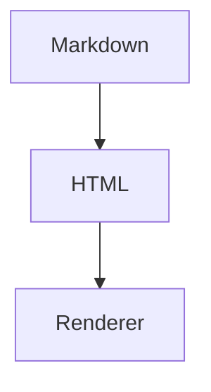

当然。下面这份可以直接保存为 `inline-html-test.md`，专门折磨你的 Markdown 渲染器——温柔一点叫测试，残忍一点叫“HTML 拷打大会”。

# Inline HTML 测试用例

普通 Markdown 段落中插入 红色 span，后面继续正常文本。

这是一段包含 <b>HTML 加粗</b>、<i>HTML 斜体</i>、<u>下划线</u>、<s>删除线</s> 的文本。

Markdown **加粗** 和 HTML <strong>strong</strong> 应该都能正常显示。

Markdown *斜体* 和 HTML <em>em</em> 应该都能正常显示。

这里测试混合嵌套：**Markdown 加粗里有 蓝色 span**，以及 <b>HTML 加粗里有 *Markdown 斜体*</b>。

---

## 链接与图片

这是一个 HTML 链接：<a href="https://github.com">GitHub</a>。

这是一个带 title 的链接：<a href="https://example.com" title="Example Site">Example</a>。

Markdown 链接旁边接 HTML： [Markdown Link](https://github.com) inline span。

HTML 图片：

行内小图标测试：文字前  文字后。

---

## code 与 pre

行内代码：这是 Markdown `inline code`，这是 HTML <code>inline code</code>。

混合测试：`这应该作为代码显示`，而这个 应该作为 HTML 显示。

HTML pre：

<pre>
function hello() {
  console.log("Hello from pre");
}
</pre>

HTML pre + code：

<pre><code>const x = 1;
const y = 2;
console.log(x + y);</code></pre>

---

## 表单元素

输入框：<input type="text" value="hello inline html">

复选框：<input type="checkbox" checked> checked

未选中：<input type="checkbox"> unchecked

按钮：<button>Click me</button>

下拉框：
<select>
  <option>Option A</option>
  <option selected>Option B</option>
</select>

---

## 样式与属性

带 class：class span

带 id：id span

带 data 属性：data-role span

内联样式：green bold text

HTML 实体：&lt;span&gt; should not become a real span.

空标签测试：before   after

水平线 HTML：

---

## 块级 HTML

这是 div 内部的普通文本。

这里有 紫色 span。

- 这里是 div 里面的 Markdown 列表，看看会不会被解析
- 第二项

段落后面继续正常 Markdown。

---

## 表格内联 HTML

| 类型 | 内容 |
|---|---|
| span | red text |
| code | <code>console.log("hi")</code> |
| link | <a href="https://github.com">GitHub</a> |
| checkbox | <input type="checkbox" checked> |

---

## 引用中的 HTML

> 这是引用。
> 
> 引用中包含 <b>HTML bold</b> 和 orange span。

---

## 列表中的 HTML

- 普通项
- 包含 <b>bold</b> 的列表项
- 包含 <code>code</code> 的列表项
- 包含 <a href="https://example.com">link</a> 的列表项

1. 有序列表 span
2. 第二项 <input type="checkbox" checked>

---

## 危险 HTML 测试

下面这些建议不要真正执行，只测试是否被安全过滤。

<iframe src="https://example.com"></iframe>

<object data="https://example.com"></object>

<embed src="https://example.com">

<a href="javascript:alert('xss')">dangerous javascript link</a>

---

## 边界情况

未闭合标签测试：这里没有闭合

下一段是否被污染？

错误嵌套：<b>bold <i>italic</b> still italic?</i>

空 span： 前后文本是否正常。

连续标签：<b>bold</b><i>italic</i><code>code</code>

HTML 注释测试：

<!-- this is a comment -->

评论后文本是否正常显示。

---

## 和公式混合

行内公式旁边 HTML：$E = mc^2$ 红色说明。

HTML 内含公式：$a^2 + b^2 = c^2$

代码里的公式：`$E = mc^2$`

---

## 和 Mermaid 混合

Mermaid 后面接 inline html 是否正常。

重点观察这几类：

安全过滤：`script`、`javascript:`、`onerror` 绝对不能执行。 
解析一致性：HTML 标签不能把后面的 Markdown “污染”。 
混合渲染：Markdown、HTML、公式、代码、表格不能互相打架。 
Typora 级体验：能显示，但不该变成浏览器野生动物园。
