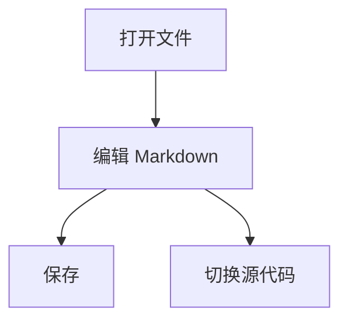

# LightMark 功能测试文档

这是一份用于手动验收编辑器行为的 Markdown 文件，覆盖标题、大纲、列表、引用、代码、表格、图片、链接、内联公式、块级公式和 Mermaid。

## 一、基础排版

普通段落应保持舒适的行高。这里放一段较长的文字用于测试自动换行：LightMark 需要像 Typora 一样让正文自然换行，内联公式 $E = mc^2$ 应该嵌在行内，公式前后的文字都应该继续正常排版，而不是在公式之后异常换到下一行。

这是 **加粗文本**，这是 *斜体文本*，这是 `inline code`，这是一个 [链接](https://github.com/)。

### 列表

- 无序列表第一项
- 无序列表第二项
  - 嵌套列表
  - 继续嵌套

1. 有序列表第一项
2. 有序列表第二项
3. 有序列表第三项

### 引用

> 这是一段引用。
> 
> 引用应显示左侧竖线和灰色正文。

## 二、公式测试

内联公式：$x^2 + y^2 = z^2$。

连续输入测试：请在编辑模式中输入两个美元符号，然后把光标放在中间，连续输入 `ab + cd`，应保持光标在公式编辑区域内。

块级公式：

$$
\frac{1}{2} + \sqrt{x} = \int_0^1 t^2\,dt
$$

方向键测试：在块级公式编辑区域开头按左方向键应回到公式前一行末尾；在末尾按右方向键应跳到公式后一行。

## 三、代码测试

```ts
type EditorMode = "wysiwyg" | "source";

function save(content: string) {
  return content.trim();
}
```

## 四、表格测试

| 功能 | 预期结果 | 状态 |
| --- | --- | --- |
| 文件树 | 左侧显示 Markdown 文件 | 待测 |
| 大纲 | 左侧切换查看 H1/H2/H3 | 待测 |
| 公式 | 编辑模式与源代码模式不丢失 | 待测 |

## 五、Mermaid 测试



## 六、图片测试


