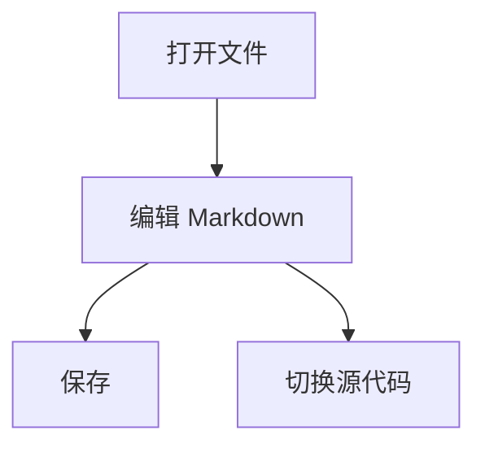
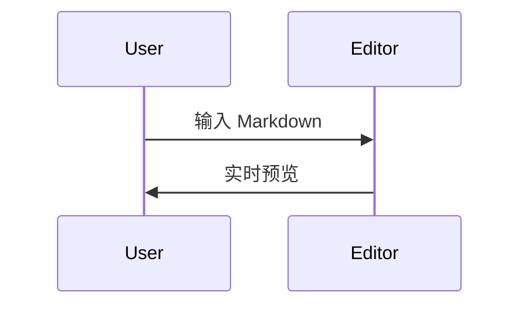

# LightMark 功能测试文档

这是一份用于手动验收编辑器行为的 Markdown 文件，覆盖标题、大纲、列表、引用、代码、表格、图片、链接、内联公式、块级公式和 Mermaid。

## 一、基础排版

普通段落应保持舒适的行高。这里放一段较长的文字用于测试自动换行：LightMark 需要像 Typora 一样让正文自然换行，内联公式 $E = mc^2$ 应该嵌在行内，公式前后的文字都应该继续正常排版，而不是在公式之后异常换到下一行。

这是 **加粗文本**，这是 _斜体文本_，这是 `inline code`，这是一个 [链接](https://github.com/)。

### 列表

-   无序列表第一项
  
-   无序列表第二项
  
    -   嵌套列表
      
    -   继续嵌套
      

1.  有序列表第一项
  
2.  有序列表第二项
  
3.  有序列表第三项
  

### 引用

> 这是一段引用。
> 
> 引用应显示左侧竖线和灰色正文。

## 二、公式测试

内联公式：$x^2 + y^2 = z^2$。

连续输入测试：请在编辑模式中输入两个美元符号，然后把光标放在中间，连续输入 `ab + cd`，应保持光标在公式编辑区域内。

块级公式：

$$
\frac{1}{2} + \sqrt{x} = \int_0^1 t^2\,dt
$$

方向键测试：在块级公式编辑区域开头按左方向键应回到公式前一行末尾；在末尾按右方向键应跳到公式后一行。

## 三、代码测试

```ts
type EditorMode = "wysiwyg" | "source";

function save(content: string) {
  return content.trim();
}
```

## 四、表格测试

| 功能 | 预期结果 | 状态 |
| --- | --- | --- |
| 文件树 | 左侧显示 Markdown 文件 | 待测 |
| 大纲 | 左侧切换查看 H1/H2/H3 | 待测 |
| 公式 | 编辑模式与源代码模式不丢失 | 待测 |

## 五、Mermaid 测试



## 六、图片测试


---

## 七、任务列表测试

基础任务列表：

-   [ ] 未完成任务
  
-   [x] 已完成任务
  
-   [ ] 第二个未完成任务
  

嵌套任务列表：

-   [ ] 主任务
  
    -   [x] 子任务 A
        
    -   [ ] 子任务 B
        
        -   [x] 更深层级任务
          

有序任务列表：

1.  [x] 初始化项目
  
2.  [ ] 实现 Markdown 渲染
  
3.  [ ] 实现 WYSIWYG 编辑
  

连续点击测试：

请连续点击多个 checkbox，确保：

-   状态实时更新
  
-   光标不会丢失
  
-   不会触发整页闪烁
  
-   Markdown 源码同步更新
  

## 八、高亮测试

这是普通文本。

这是 ==高亮文本==。

高亮与其他样式混合：

-   **==加粗高亮==**
  
-   _==斜体高亮==_
  
-   `代码高亮`
  
-   ==含有== [==链接==](https://example.com) ==的高亮==
  

边界测试：

==高亮开始 跨行后是否正常==

==前后是否正确处理空格== 。

## 九、脚注测试

这里有一个脚注引用。[^1]

这里有第二个脚注。[^long]

同一个脚注重复引用。[^1]

[^1]: 这是一个简单脚注。 

[^long]: 这是一个较长的脚注。 它应该支持： - 段落 - 列表 - **Markdown 样式** - <code>代码高亮</code>

脚注行为测试：

-   点击脚注编号应跳转到底部
  
-   点击返回按钮应回到原位置
  
-   编辑模式中脚注不应错位
  

## 十、上下标测试

上标：

x^2^

速度单位：m/s^2^

下标：

H~2~O

CO~2~

复杂混合：

~~错误文本~~ 与 H~2~O 和 x^2^ 同时出现。

边界测试：

-   上标结束后继续输入文字应正常
  
-   删除 `^` 不应导致 DOM 错乱
  
-   连续输入 `x123abc` 应正确恢复普通文本
  

## 十一、自动链接测试

裸 URL：

[https://github.com/](https://github.com/)

[http://localhost:3000/](http://localhost:3000/)

带参数 URL：

[https://example.com/search?q=lightmark&lang=zh-CN](https://example.com/search?q=lightmark&lang=zh-CN)

邮件地址：

[test@example.com](mailto:test@example.com)

自动链接行为测试：

-   点击应打开浏览器
  
-   不应错误包含句号
  
-   中文后接 URL 不应解析错误
  

例如：

这是链接：[https://github.com/LightMark](https://github.com/LightMark) 。

## 十二、Emoji 测试

基础 Emoji：

😄 🚀 🔥 ⚠️

混合文本：

LightMark is awesome :sparkles:

中文混合：

这是一个 ❤️ Emoji 测试。

边界测试：

::notemoji::

:123:

:smile

## 十三、目录（TOC）测试

[TOC]

请确认：

-   自动生成目录
  
-   H1-H6 都能识别
  
-   点击目录可以跳转
  
-   当前标题高亮（如果支持）
  
-   标题修改后目录实时更新
  

## 十四、YAML Front Matter 测试

请确认 Front Matter：

-   不会被当正文渲染
  
-   能正确解析
  
-   不影响正文编辑
  

```yaml
---
title: LightMark Test Document
author: Liu Hetong
date: 2026-05-23
tags:
  - markdown
  - editor
  - tauri
draft: false
---
```

正文应从这里开始。

## 十五、定义列表测试

Markdown

一种轻量级标记语言

LightMark

一个使用 Rust + Tauri 构建的 Markdown 编辑器

WYSIWYG

What You See Is What You Get

复杂定义：

Mermaid

支持流程图

: 支持时序图 : 支持状态图

## 十六、内联 HTML 测试

基础 HTML：

带样式 HTML：

复杂 HTML：

HTML 与 Markdown 混合：

请确认： - 是否允许 script - 是否进行 sanitize - 不安全标签是否被过滤

## 十七、H4-H6 标题测试

#### H4 标题

用于测试较深层级大纲。

##### H5 标题

测试字体大小与缩进。

###### H6 标题

测试最小标题层级。

请确认：

-   大纲正确显示 H1-H6
  
-   折叠逻辑正常
  
-   不同层级字号正确
  
-   Anchor 跳转正确
  

## 十八、复杂混合场景测试

> ## 引用中的标题
> 
> 包含：
> 
> -   [x] 任务列表
>     
> -   ==高亮==
>     
> -   H~2~O
>     
> -   x^2^
>     
> -   🚀
>     
> 
> 以及公式：
> 
> $$ E = mc^2 $$

复杂列表：

1.  第一项
  
    -   子列表
      
        > 引用
        > 
        > ```ts
        > const x = 1;
        > ```
    
2.  第二项包含 Mermaid：
  



## 十九、超长文本性能测试

下面是一段用于测试：

-   大文档滚动性能
  
-   光标定位
  
-   diff 更新
  
-   虚拟滚动
  
-   增量渲染
  

Lorem ipsum dolor sit amet, consectetur adipiscing elit. Vestibulum vulputate mauris ut nisl malesuada, vitae volutpat lectus consequat. Pellentesque habitant morbi tristique senectus et netus et malesuada fames ac turpis egestas.

Lorem ipsum dolor sit amet, consectetur adipiscing elit. Vestibulum vulputate mauris ut nisl malesuada, vitae volutpat lectus consequat. Pellentesque habitant morbi tristique senectus et netus et malesuada fames ac turpis egestas.

Lorem ipsum dolor sit amet, consectetur adipiscing elit. Vestibulum vulputate mauris ut nisl malesuada, vitae volutpat lectus consequat. Pellentesque habitant morbi tristique senectus et netus et malesuada fames ac turpis egestas.

（建议这里实际复制几十段）

## 二十、编辑器行为测试

请人工测试以下行为：

1.  输入法兼容
  
    -   中文输入时不闪烁
      
    -   拼音阶段不提前渲染
      
    -   候选框位置正确
    
2.  Undo / Redo
  
    -   Ctrl+Z
      
    -   Ctrl+Shift+Z
      
    -   多块编辑恢复正确
    
3.  光标行为
  
    -   点击公式内部
      
    -   点击代码块边缘
      
    -   多行选择
      
    -   Shift + 方向键
    
4.  粘贴行为
  
    -   粘贴富文本
      
    -   粘贴代码
      
    -   粘贴图片
      
    -   粘贴 HTML
    
5.  大文件行为
  
    -   打开 1MB Markdown
      
    -   搜索性能
      
    -   滚动 FPS
      
    -   内存占用
      

## 二十一、最终验收检查

请确认：

-   Markdown 源码与渲染一致
  
-   不会随机丢失光标
  
-   不会出现 DOM 跳动
  
-   不会重复渲染
  
-   不会出现无限刷新
  
-   保存后内容一致
  
-   重启后状态恢复正常
  
-   暗色模式下颜色正常
  
-   Windows DPI 缩放正常
  
-   Linux 下字体正常
  
-   Emoji 不乱码
  
-   Mermaid 不溢出
  
-   KaTeX 不闪烁
  

如果以上全部通过，则说明 LightMark 已具备较完整的现代 Markdown 编辑器基础能力。

**ddd**

_ddd_

`dddd`

> dddd

1.  222
  
2.  222
  

-   ddd
  
-   ddd
  

