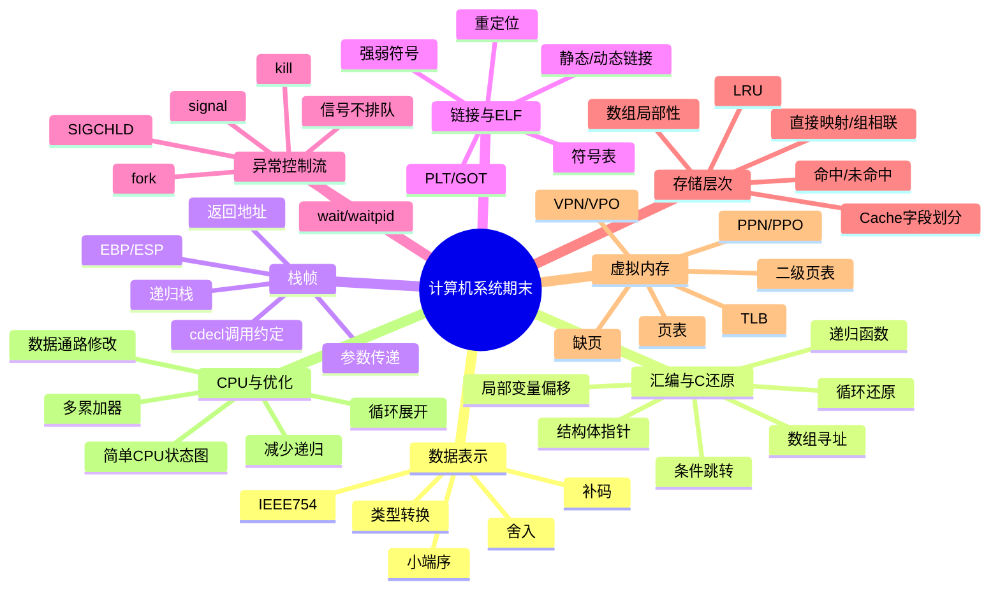
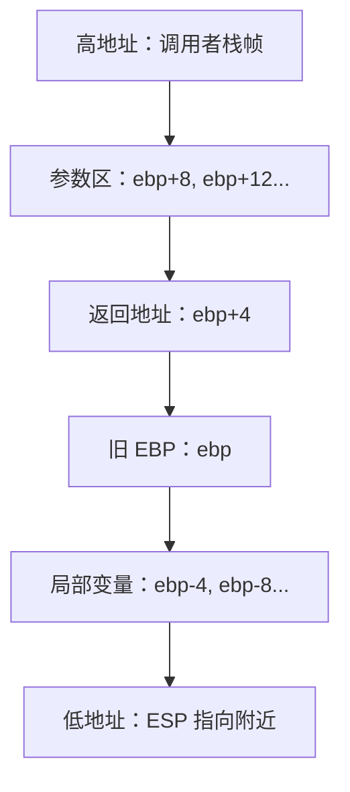
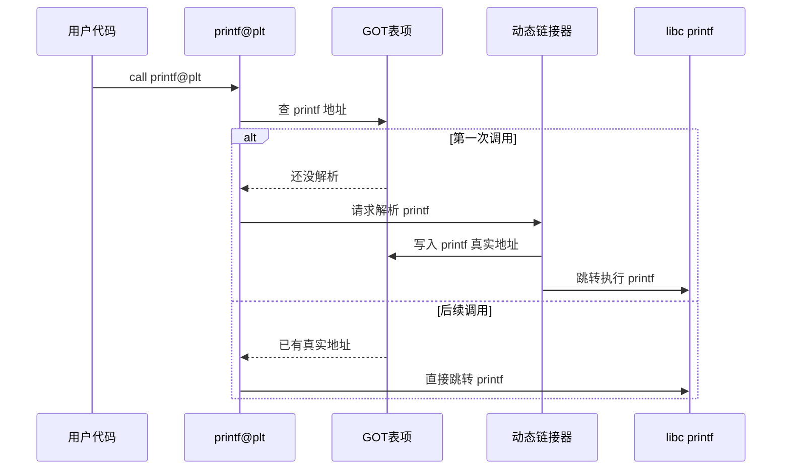
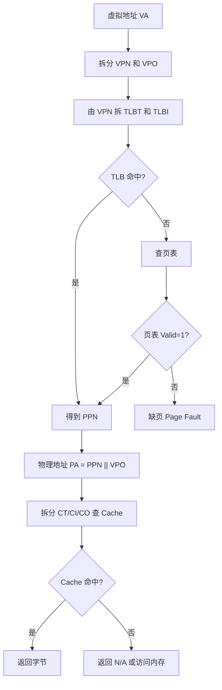
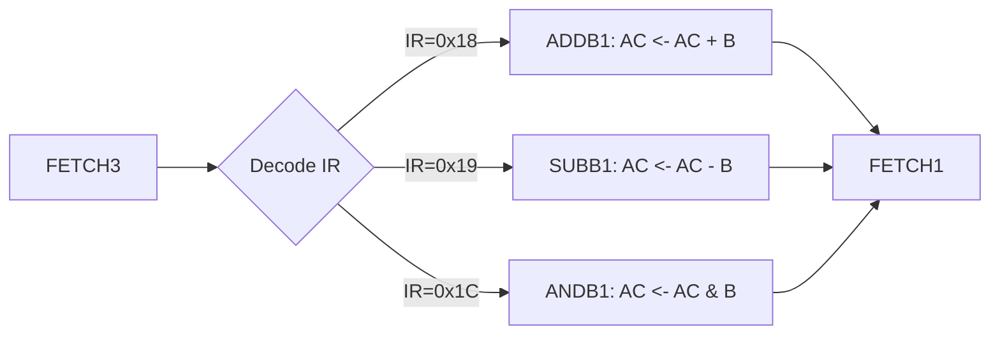
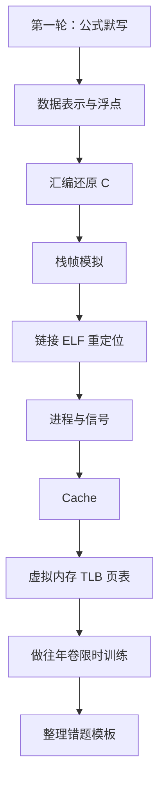

# 计算机系统期末考点清单（2020—2025 春 A 卷归纳版）

> 适用场景：期末冲刺、往年卷复盘、考前默写。  
> 一句话总览：这门课的期末卷不是“背概念”，而是反复考你能不能把 **位级表示 → 汇编/栈 → 链接/进程 → 存储层次/虚拟内存** 串成一条线。老师的出题风格很稳定：同一套武功换皮肤，招式没怎么变。

---

## 0. 高频考点雷达图



---

## 1. 高频考点总表

| 模块 | 常考程度 | 常见题型 | 你要会什么 |
|---|---:|---|---|
| IEEE754 与补码 | ★★★★★ | 简答题第 1 题 | 手算浮点编码、规格化/非规格化、最大最小、舍入、精度边界 |
| C 与汇编互推 | ★★★★★ | 程序填空题 | 看 `mov/add/sub/imul/cmp/jmp` 还原 C 代码 |
| 栈帧与函数调用 | ★★★★★ | 综合应用题 | 根据 `%esp/%ebp` 填局部变量、参数、返回地址 |
| ELF、链接、重定位 | ★★★★★ | 分析题 | 符号类型、强弱符号、`.text/.data/.bss`、`R_386_PC32`、PLT/GOT |
| 进程与信号 | ★★★★☆ | 分析题 | `fork/wait/kill/signal/SIGCHLD`，信号不排队，僵尸进程 |
| Cache | ★★★★☆ | 综合题 | 地址字段划分、命中判断、LRU、数组访问时间 |
| 虚拟内存/TLB | ★★★★★ | 大题 | VA/PA/TLB/页表/Cache 一条龙翻译 |
| 简单 CPU 数据通路 | ★★☆☆☆ | 设计题 | 加寄存器/新指令时改状态图和数据通路 |
| 程序优化 | ★★★☆☆ | 分析题小问 | 循环展开、多累加器、提升局部性、递归改循环 |

---

# 第一部分：数据表示

## 1.1 补码整数

### 考察方式

常见问法：给定位数求补码范围；给定负数写二进制；`int / short / unsigned` 互转；指针强制类型转换后按位解释；小端环境下看内存字节。

### 核心结论

对于 $w$ 位补码整数：

$$TMin_w=-2^{w-1}$$

$$TMax_w=2^{w-1}-1$$

表示范围：

$$[-2^{w-1},\;2^{w-1}-1]$$

例如 10 bit 补码：

$$[-512,\;511]$$

对应二进制：

```text
最小值 -512: 1000000000
最大值  511: 0111111111
```

### 二级结论

1. 补码最高位权重是负的：

$$x=-b_{w-1}2^{w-1}+\sum_{i=0}^{w-2}b_i2^i$$

2. 负数求补码：

```text
先写正数二进制 → 按位取反 → 加 1
```

3. unsigned 与 signed 位模式不变，只是解释方式变了。

例如 8 bit：

```text
11111111
signed   = -1
unsigned = 255
```

### 速记

> 补码范围：负数多一个。因为 0 被非负数那边占了一个坑，负数区只能默默多干一个活。

---

## 1.2 IEEE754 浮点数

### 考察方式

往年卷非常爱考“缩小版 IEEE754”，比如 10 bit、8 bit：

```text
符号位 S：1 bit
阶码位 E：k bit
尾数字段 M：n bit
```

你要能算：某个十进制数的浮点编码；最大规格化数；最大非规格化数；最小不能精确表示的整数；int 转 float 为什么不会溢出但可能舍入；HNU 自定义 bias 与 IEEE bias 的差异。

### 基本结构

```text
S | Exp | Frac
```

| 类型 | 阶码字段 | 尾数字段 | 数值 |
|---|---|---|---|
| 非规格化数 | 全 0 | 任意 | $(-1)^S \times 0.f \times 2^{1-Bias}$ |
| 规格化数 | 非全 0 且非全 1 | 任意 | $(-1)^S \times 1.f \times 2^{E-Bias}$ |
| 特殊值 | 全 1 | 0 或非 0 | $\infty$ 或 NaN |

IEEE754 的偏置值：

$$Bias=2^{k-1}-1$$

### 最大非规格化正数

阶码全 0，尾数全 1：

$$(0.\underbrace{111\cdots111}_{n})_2 \times 2^{1-Bias}=(1-2^{-n})2^{1-Bias}$$

二进制编码：

```text
0 000...000 111...111
```

### 最小正规格化正数

阶码为 1，尾数全 0：

$$1.0\times2^{1-Bias}$$

二进制编码：

```text
0 000...001 000...000
```

### 最大规格化正数

阶码为全 1 前一个，即 $E=2^k-2$，尾数全 1：

$$(1.\underbrace{111\cdots111}_{n})_2 \times 2^{(2^k-2)-Bias}=(2-2^{-n})2^{2^k-2-Bias}$$

二进制编码：

```text
0 111...110 111...111
```

### 精确表示整数的关键

规格化浮点数有效位数是：

$$p=n+1$$

因为规格化数有隐藏的 `1.`。

所以：

- 当整数位数不超过 $p$ 时，通常能精确表示；
- 当整数超过 $p$ 位后，并非所有整数都能表示；
- 在 $[2^p,2^{p+1})$ 范围内，浮点间隔变成 2；
- 因此常见“最小不能精确表示的正整数”是：

$$2^p+1=2^{n+1}+1$$

例：10 bit 浮点，1 符号位、4 阶码位、5 尾数位，有效位数 $p=6$，最小不能精确表示的正整数是：

$$2^6+1=65$$

因为：

```text
64 = 1.00000 × 2^6，可以表示
65 = 1.000001 × 2^6，需要 7 位有效位，装不下
```

### 舍入：向偶数舍入

IEEE754 默认常见舍入规则是“round to nearest, ties to even”。

```text
离谁近就舍到谁；
正好在中间，就舍到最低有效位为 0 的那个可表示数。
```

注意“偶数”不是十进制偶数，而是浮点尾数最低位为 0 的那个可表示数。

### int 转 float：不会溢出但可能舍入

卷面答法：

```text
int 的数值范围通常远小于 float 的数值范围，因此 int 转 float 不会发生溢出；
但 float 的有效位数有限，当整数有效二进制位数超过尾数可容纳的精度时，低位会被舍入，因此可能不精确。
```

### 速记

> 浮点不是“精确数”，是“科学计数法停车场”。车位很多，所以不容易溢出；车位有间隔，所以大整数可能停不准。

---

## 1.3 小端序与类型重解释

### 考察方式

常见写法：

```c
int *pi = &f;
int i = *pi;
float *pf = &ui;
```

或者 union 中 `int *`、`char *`、`int` 共享内存。

### 核心结论

小端序：

```text
低地址存低有效字节
高地址存高有效字节
```

例如：

```text
int x = 0x12345678
```

内存从低地址到高地址：

```text
78 56 34 12
```

### 类型转换 vs 指针强转

| 写法 | 含义 |
|---|---|
| `(float)i` | 数值转换，值尽量保持 |
| `(int)f` | 数值转换，截断小数 |
| `(float *)&i` | 不改 bit，按 float 解释原来的 bit |
| union 共享字段 | 不改 bit，换解释器 |

### 速记

> 普通强转：换值。指针强转：换眼镜。union：同一块肉，换刀切。

---

# 第二部分：汇编还原 C 代码

## 2.1 32 位 x86 常用寄存器与指令

| 寄存器 | 常见作用 |
|---|---|
| `%eax` | 函数返回值、临时值 |
| `%edx` | 临时值 |
| `%ecx` | 临时值 |
| `%ebx` | 被调用者保存 |
| `%esp` | 栈顶指针 |
| `%ebp` | 栈帧基址 |

| 汇编 | 含义 |
|---|---|
| `movl A, B` | B = A |
| `addl A, B` | B += A |
| `subl A, B` | B -= A |
| `imull A, B` | B *= A |
| `leal addr, reg` | reg = 地址表达式，不访问内存 |
| `cmpl A, B` | 比较 B - A |
| `testl A, A` | 判断 A 是否为 0 |
| `je/jz` | 等于 / 为 0 跳转 |
| `jne/jnz` | 不等 / 非 0 跳转 |
| `jg/jge` | 有符号大于 / 大于等于 |
| `jl/jle` | 有符号小于 / 小于等于 |
| `ja/jae` | 无符号大于 / 大于等于 |
| `jb/jbe` | 无符号小于 / 小于等于 |

### `cmpl A, B` 的大坑

```asm
cmpl $6, %eax
jle .L2
```

含义是：

```c
if (eax <= 6) goto L2;
```

因为 `cmpl A,B` 算的是 `B - A`。

速记：

> `cmp A, B` 看成“B 和 A 比”。后面的跳转条件默认说的是 B。

---

## 2.2 局部变量偏移识别

```asm
movl $17, -8(%ebp)
movl $5, -16(%ebp)
```

对应某些局部变量被赋初值。

在没有优化时，局部变量通常在：

```text
-4(%ebp), -8(%ebp), -12(%ebp) ...
```

如果使用对齐后的 `%esp`：

```asm
movl $0, 28(%esp)
movl $1, 32(%esp)
```

则局部变量会用 `%esp + 偏移` 表示。

速记：

> `%ebp` 正偏移：找参数。`%ebp` 负偏移：找局部变量。`%esp` 偏移：老师把栈对齐后，变量可能就住在 `%esp` 楼盘了。

---

## 2.3 数组寻址公式

一维数组：

$$\&a[i]=base+i\times4$$

汇编常见：

```asm
movl a(,%eax,4), %edx
```

含义：

```c
edx = a[eax];
```

二维数组行优先：

```c
int a[R][C];
a[i][j]
```

地址：

$$\&a[i][j]=base+(i\times C+j)\times4$$

如果汇编出现：

```asm
imull $23, %eax, %eax
addl j, %eax
movl array1(,%eax,4), %ecx
```

说明列数是 23。

速记：

> C 语言二维数组是“按行摊平的一维数组”。公式永远是：`i * 列数 + j`。

---

## 2.4 循环还原套路

### for 循环

```c
for (init; cond; update) {
    body;
}
```

汇编常见形态：

```asm
init
jmp .Lcond
.Lbody:
    body
    update
.Lcond:
    cmp ...
    jxx .Lbody
```

### do-while 循环

```c
do {
    body;
} while (cond);
```

汇编常见：

```asm
.Lbody:
    body
    cmp ...
    jxx .Lbody
```

### continue 的识别

如果 C 里有：

```c
if (cond) continue;
sum += ...;
```

汇编会跳过循环体后半段，直接去 update/condition。

速记：

> `for` 是先验票再进门；`do-while` 是先进门再验票；`continue` 是中途被老师抓走，直接去下一轮。

---

## 2.5 函数递归识别

看到：

```asm
call f
...
call f
add ...
```

重点找：

- base case：`cmp $0`、`cmp $1`、`cmp $2`；
- 递归参数：`sub $1`、`sub $2`、`add $3`；
- 返回表达式：几个递归结果如何相加或相乘。

常见 Fibonacci 还原：

```c
int function(int f) {
    int e = 0;
    if (f == 0) e = 0;
    else if (f == 1 || f == 2) e = 1;
    else e = function(f-1) + function(f-2);
    return e;
}
```

速记：

> 看到 `call 自己`，先别慌，八成是 Fibonacci 或树。找 base case，再找递归参数。

---

# 第三部分：栈帧与函数调用

## 3.1 cdecl 调用约定

32 位 Linux 常用 cdecl：

1. 参数从右到左入栈；
2. `call` 自动压入返回地址；
3. 被调用函数保存旧 `%ebp`；
4. 返回值放 `%eax`；
5. 调用者清理参数空间。

标准函数开头：

```asm
push %ebp
mov %esp, %ebp
sub $N, %esp
```

函数结尾：

```asm
leave
ret
```

`leave` 等价于：

```asm
mov %ebp, %esp
pop %ebp
```

`ret` 等价于弹出返回地址到 EIP。

---

## 3.2 栈帧结构图

```text
高地址
+------------------+
| 调用者局部变量     |
+------------------+
| 参数 n            |  ebp + 12 / 16 ...
+------------------+
| 参数 1            |  ebp + 8
+------------------+
| 返回地址           |  ebp + 4
+------------------+
| old ebp           |  ebp
+------------------+
| 被调用者局部变量    |  ebp - 4, ebp - 8...
+------------------+
低地址
```



---

## 3.3 栈帧填空题做法

1. 根据题目给的初始 `%esp`，模拟 `push %ebp`：`esp -= 4`。
2. 执行 `mov %esp,%ebp`，得到当前函数 `%ebp`。
3. 执行 `sub $N,%esp`，得到局部变量区域。
4. 根据汇编偏移填值：`movl $0xa, 0x18(%esp)` 就填 `esp+0x18` 处等于 10。
5. 遇到 `call`：额外压返回地址。

速记：

> 栈向低地址长。`push` 是 `%esp -= 4`。`call` 是“偷偷 push 返回地址”。`ret` 是“偷偷 pop 到 EIP”。

### 参数位置速记

| 位置 | 内容 |
|---|---|
| `0(%ebp)` | old ebp |
| `4(%ebp)` | return address |
| `8(%ebp)` | 第 1 个参数 |
| `12(%ebp)` | 第 2 个参数 |
| `16(%ebp)` | 第 3 个参数 |
| `-4(%ebp)` | 第 1 个局部变量附近 |

> 参数从 `ebp+8` 开始，局部变量从 `ebp-4` 开始，`ebp+4` 是回家的车票。

---

# 第四部分：ELF、链接与重定位

## 4.1 可重定位目标文件结构

| 节 | 内容 |
|---|---|
| `.text` | 机器指令 |
| `.rodata` | 只读数据，如字符串常量 |
| `.data` | 已初始化的全局变量、静态变量 |
| `.bss` | 未初始化或初始化为 0 的全局/静态变量 |
| `.symtab` | 符号表 |
| `.rel.text` | `.text` 节的重定位信息 |
| `.rel.data` | `.data` 节的重定位信息 |
| `.debug` | 调试信息 |
| `.strtab` | 字符串表 |
| 节头部表 | 描述各节位置和大小 |

速记：

> `.text` 放代码，`.rodata` 放常量字符串，`.data` 放有初值，`.bss` 放零宝宝。

---

## 4.2 符号分类

| 符号 | 例子 | 类型 |
|---|---|---|
| 全局定义符号 | `int x=1; void f(){}` | 本模块定义，可被其他模块引用 |
| 外部符号 | `extern int x;` | 本模块引用，其他模块定义 |
| 局部符号 | `static int x; static void f(){}` | 只在本模块可见 |
| 局部变量 | 函数内部 `int i` | 通常不进 `.symtab`，在栈上 |

注意：`static int x;` 这里的 static 是文件作用域局部符号，不是栈上变量。

---

## 4.3 强符号与弱符号

| 写法 | 属性 |
|---|---|
| 函数定义 | 强符号 |
| 已初始化全局变量 | 强符号 |
| 未初始化全局变量 | 弱符号 |
| `extern` 声明 | 不是定义，只是引用 |

链接器多重定义规则：

1. 不允许多个同名强符号；
2. 一个强符号和多个弱符号同名，选强符号；
3. 多个弱符号同名，任选一个，可能产生隐蔽 bug。

经典坑：

```c
// main.c
int d = 50;

// p.c
double d;
```

链接器选择强符号 `int d`。但 `p.c` 里按 `double` 写 `d=1.0`，会覆盖从 `d` 开始的 8 字节，于是可能把相邻变量也改坏。

速记：

> 函数和有初值全局变量是“强哥”；没初值全局变量是“弱弟”；强弱同名听强哥的，强强同名直接吵炸。

---

## 4.4 重定位

编译单个 `.c` 文件生成 `.o` 时，编译器还不知道外部函数和变量最终地址，所以先留下“坑”，链接器最后填坑。

### 常见重定位类型

#### `R_386_PC32`

用于相对地址调用，比如：

```asm
call sweet
```

计算公式：

$$重定位值=S+A-P$$

| 符号 | 含义 |
|---|---|
| $S$ | 被引用符号最终地址 |
| $A$ | 原来指令中的 addend，常见如 `0xfffffffc` |
| $P$ | 重定位位置的地址 |

对于 x86 `call rel32`，机器码中存的是“下一条指令相对目标地址的偏移”：

$$call偏移=目标函数地址-call下一条指令地址$$

#### `R_386_32`

用于绝对地址引用全局变量：

$$重定位值=S+A$$

---

## 4.5 PLT/GOT 与动态链接

反汇编中常见：

```asm
call 80483e0 <printf@plt>
```

PLT：Procedure Linkage Table，过程链接表。  
GOT：Global Offset Table，全局偏移表。

作用：程序先跳到 PLT，再通过 GOT 找到真正的动态库函数地址。



为什么有的 call 没有 `@plt`？

```text
如果调用的是同一个可执行文件内部的函数，链接器可以直接确定目标地址，不需要 PLT。
```

速记：

> 调外面的库函数：走 PLT/GOT 中介。调自己家的函数：能直达就直达。

---

## 4.6 编译链接命令

一步到位：

```bash
gcc main.c compute.c globals.c child_handler.c -o test
```

分离编译：

```bash
gcc -c main.c -o main.o
gcc -c compute.c -o compute.o
gcc -c globals.c -o globals.o
gcc -c child_handler.c -o child_handler.o
gcc main.o compute.o globals.o child_handler.o -o test
```

静态链接：

```bash
gcc -static main.o compute.o globals.o child_handler.o -o test
```

---

# 第五部分：进程与信号

## 5.1 fork

```c
pid_t pid = fork();
```

| 位置 | 返回值 |
|---|---|
| 子进程中 | 0 |
| 父进程中 | 子进程 PID |
| 出错 | -1 |

fork 后父子进程几乎拥有相同的虚拟地址空间副本，并从 `fork()` 返回处继续执行。谁先运行由调度器决定，所以输出顺序通常不确定。

速记：

> fork 像影分身。分身从同一句台词后面继续演，不是从 main 开头重播。

---

## 5.2 wait 与 waitpid

```c
pid_t pid = wait(&status);
```

作用：阻塞等待任意一个子进程结束；回收子进程资源；防止僵尸进程；返回被回收子进程 PID；通过 `status` 获取退出状态。

```c
waitpid(pid, &status, options);
```

| 用法 | 含义 |
|---|---|
| `waitpid(-1, &status, 0)` | 等价于 wait |
| `waitpid(pid, &status, 0)` | 等指定子进程 |
| `waitpid(-1, &status, WNOHANG)` | 非阻塞回收 |

速记：

> wait 是“谁先死收谁”；waitpid 是“点名收尸”，话糙但好记。

---

## 5.3 信号

| 信号 | 含义 |
|---|---|
| `SIGINT` | Ctrl+C，终端中断 |
| `SIGCHLD` | 子进程终止或停止时发给父进程 |
| `SIGUSR1` | 用户自定义信号 1 |
| `SIGALRM` | 定时器信号 |

```c
signal(SIGINT, handler);
```

表示收到 SIGINT 时执行 handler。

```c
kill(pid, SIGINT);
```

表示向 pid 对应进程发送 SIGINT。`kill` 不一定是杀死，它只是“发信号”。

---

## 5.4 SIGCHLD 的典型问题

错误写法：

```c
void sigchld_handler(int sig) {
    wait(&status);
}
```

问题：多个子进程几乎同时结束时，标准信号不排队，只处理一次 `wait` 可能留下僵尸进程；而且信号处理函数中调用 `printf` 不安全。

标准解决：

```c
void sigchld_handler(int sig) {
    int olderrno = errno;
    while (waitpid(-1, NULL, WNOHANG) > 0) {
        ;
    }
    errno = olderrno;
}
```

标准信号不排队：

```text
如果同一种信号在阻塞期间来了多次，内核通常只记录“至少来过一次”，不会记录来了几次。
```

速记：

> 标准信号像老师点名：“有人到了！”不是快递单号：“1号到了、2号到了、3号到了……”

---

# 第六部分：Cache 与存储层次

## 6.1 Cache 参数

| 符号 | 含义 |
|---|---|
| $C$ | Cache 数据容量 |
| $B$ | 每块字节数 |
| $E$ | 每组行数，几路组相联 |
| $S$ | 组数 |
| $m$ | 地址位数 |

关系：

$$C=S\times E\times B$$

$$S=\frac{C}{E\times B}$$

字段位数：

$$b=\log_2B$$

$$s=\log_2S$$

$$t=m-s-b$$

地址划分：

```text
| tag t位 | set index s位 | block offset b位 |
```

---

## 6.2 直接映射与组相联

直接映射：

```text
E = 1
```

一个内存块只能放到唯一一组。

行号：

$$line=\left\lfloor\frac{addr}{B}\right\rfloor\bmod S$$

块内偏移：

$$offset=addr\bmod B$$

E 路组相联：一个组里有 E 行，块可以放进这个组的任意一行。

判断命中：

1. 用 `CI` 找组；
2. 在组内逐行比较 tag；
3. valid=1 且 tag 相等则命中；
4. 否则未命中。

LRU：替换最近最少使用的那一行。

---

## 6.3 Cache 访问时间

如果不用 Cache：

$$T=N\times100ns$$

如果用 Cache，命中一次 1ns，未命中一次 101ns：

$$T=Hit\times1+Miss\times101$$

速记：

> Cache 命中就是去桌面拿书；Cache 未命中就是先摸桌面发现没有，再跑图书馆。

---

## 6.4 数组访问与局部性

C 语言二维数组行优先：

```text
Arr[0][0], Arr[0][1], Arr[0][2], Arr[0][3], Arr[1][0]...
```

地址公式：

$$addr(Arr[i][j])=base+(i\times C+j)\times sizeof(int)$$

行优先访问局部性好；列优先访问可能局部性差。

速记：

> C 数组横着放，横着扫舒服；竖着扫，Cache 可能当场翻白眼。

---

## 6.5 Cache 实际总容量

如果题目问“考虑有效位等额外存储空间”，要加上数据位、tag 位、valid 位，可能还有 dirty 位、LRU 位。

直接映射每行：

$$每行总位数=数据块位数+tag位数+valid位$$

数据块位数：

$$B\times8$$

总容量：

$$总位数=行数\times每行总位数$$

---

# 第七部分：虚拟内存、TLB 与地址翻译

## 7.1 基本字段

虚拟地址：

```text
| VPN | VPO |
```

物理地址：

```text
| PPN | PPO |
```

页大小为 $P$ 字节：

$$p=\log_2P$$

- VPO 位数 = PPO 位数 = $p$；
- VPN 位数 = VA 位数 - $p$；
- PPN 位数 = PA 位数 - $p$。

---

## 7.2 TLB 字段

TLB 是页表缓存。如果 TLB 有 $S$ 组：

$$TLBI位数=\log_2S$$

$$TLBT位数=VPN位数-TLBI位数$$

从 VPN 中划分：

```text
| TLBT | TLBI |
```

注意：TLB index 来自 VPN 的低位，不是整个虚拟地址的低位。

速记：

> 页内偏移不参与 TLB 查找。TLB 管的是“页号到页框号”，页内偏移原封不动搬过去。

---

## 7.3 地址翻译流程



---

## 7.4 物理地址查 Cache

如果 Cache 块大小 $B$，组数 $S$，物理地址位数 $m$：

$$CO=\log_2B$$

$$CI=\log_2S$$

$$CT=m-CI-CO$$

物理地址：

```text
| CT | CI | CO |
```

查 Cache：用 CI 找组，比较 CT，valid=1 且 tag 相等则命中，用 CO 取块内第几个字节。

---

## 7.5 缺页时怎么填

如果页表项 valid=0：

```text
PPN = N/A
物理地址部分不填
Cache 部分不填
```

因为连物理地址都不存在，Cache 不用看。

---

## 7.6 二级页表

32 位线性地址常见划分：

```text
| PDE index 10位 | PTE index 10位 | Page offset 12位 |
```

因为页大小 4KB，offset=12 位；每个页表 4KB，每个 PTE 4B，所以 $4KB/4B=1024=2^{10}$，PDE/PTE 各 10 位。

PDE 地址：

$$PDEAddr=PDBA+PDEIndex\times4$$

PDE 内容高 20 位是二级页表基址：

$$PTBase=PDE\&0xFFFFF000$$

PTE 地址：

$$PTEAddr=PTBase+PTEIndex\times4$$

最终物理地址：

$$PA=(PTE\&0xFFFFF000)+Offset$$

TLB 命中时：

$$PA=(PPN<<offsetBits)|VPO$$

---

## 7.7 虚拟地址题标准模板

```text
页大小 = ...，所以 VPO/PPO = ... 位。
VPN = VA 高位，VPO = VA 低位。

TLB 共有 ... 组，所以 TLBI = ... 位，TLBT = VPN 剩余高位。
查 TLB 第 TLBI 组，若存在 Valid=1 且 Tag=TLBT，则 TLB 命中，得到 PPN。
若未命中，则查页表 VPN 项。
若页表 Valid=0，则缺页；若 Valid=1，则得到 PPN。

物理地址 PA = PPN || VPO。
Cache 块大小为 ...，所以 CO=... 位；Cache 组数为 ...，所以 CI=... 位；CT 为剩余高位。
查 Cache 第 CI 组，比较 CT 和 Valid，判断命中。
若命中，用 CO 取对应字节；若未命中，返回 N/A。
```

速记：

> 先翻译，再缓存。TLB 看虚拟页号，Cache 多数题看物理地址。偏移不翻译，页号才翻译。

---

# 第八部分：简单 CPU 与数据通路设计

## 8.1 常考方式

给一个简单 CPU，要求新增寄存器 B 和新指令：

```text
ADDB: AC <- AC + B
SUBB: AC <- AC - B
ANDB: AC <- AC & B
```

要画状态图增加部分和数据通路 ALU/寄存器修改。

## 8.2 状态图怎么改



## 8.3 数据通路怎么改

卷面答法：

```text
在数据通路中增加 8 位寄存器 B，并将 B 的输出通过三态门或多路选择器接入 ALU 的一个输入端；AC 的输出接入 ALU 的另一个输入端。ALU 增加控制信号以选择 ADD、SUB、AND 运算。ALU 运算结果经总线或直接通路写回 AC。控制器在 IR=00011000、00011001、00011100 时分别进入 ADDB、SUBB、ANDB 状态，产生相应 ALUop 和 AC 写使能信号。
```

---

# 第九部分：程序优化

## 9.1 常考优化点

| 优化 | 用途 |
|---|---|
| 循环展开 | 减少循环控制开销 |
| 多累加器 | 提高指令级并行 |
| 重新结合 | 减少数据相关 |
| 代码移动 | 把循环不变量移出去 |
| 强度削弱 | 乘法改加法/移位 |
| 改善局部性 | 更好利用 Cache |
| 递归改循环 | 避免栈溢出和函数调用开销 |

## 9.2 加权平方和优化模板

原代码：

```c
int compute_sum_squares(int *array, int size) {
    int sum = 0;
    for (int i = 0; i < size; i++) {
        sum += array[i] * array[i] * global_factor;
    }
    return sum;
}
```

优化：

```c
int compute_sum_squares(int *array, int size) {
    int factor = global_factor;
    int sum0 = 0, sum1 = 0;
    int i = 0;

    for (; i + 1 < size; i += 2) {
        int a0 = array[i];
        int a1 = array[i + 1];
        sum0 += a0 * a0 * factor;
        sum1 += a1 * a1 * factor;
    }

    for (; i < size; i++) {
        int a = array[i];
        sum0 += a * a * factor;
    }

    return sum0 + sum1;
}
```

为什么快：提前读 `factor`，减少内存访问；两个累加器减少数据依赖；循环展开减少分支次数；顺序访问数组，Cache 友好。

## 9.3 递归改循环

冰雹猜想递归版可能步骤多导致栈溢出。改成循环：

```c
int P(int x) {
    while (1) {
        printf("%d\n", x);
        if (x < 0 || x == 1) return 0;
        if (x % 2 == 0)
            x = x / 2;
        else
            x = x * 3 + 1;
    }
}
```

原因：循环复用同一个栈帧，不会随着步骤数增加不断创建新的函数调用栈帧。

---

# 第十部分：卷面答题模板

## 10.1 浮点数题模板

```text
该浮点格式有 1 位符号位、k 位阶码位、n 位尾数位，所以 Bias=2^(k-1)-1。
对于规格化数，数值为 (-1)^s × 1.frac × 2^(E-Bias)；
对于非规格化数，数值为 (-1)^s × 0.frac × 2^(1-Bias)。

将十进制数转为二进制科学计数法，确定符号位、阶码字段和尾数字段。
若尾数位不足，则按照向偶数舍入规则进行舍入。
```

## 10.2 汇编还原 C 题模板

```text
先根据 movl 立即数到栈偏移确定局部变量初值；
再根据 leal/addl/imull 识别指针和数组地址；
根据 cmpl 与条件跳转还原 if/while/for；
根据 call 和参数压栈位置还原函数调用；
最后把返回值所在 eax 对应到 C 语言 return 或赋值语句。
```

## 10.3 栈帧题模板

```text
根据题目给出的初始 ESP，依次模拟 push、mov、sub、call。
push 使 ESP 减 4，call 会压入返回地址。
进入函数后，0(%ebp) 为旧 EBP，4(%ebp) 为返回地址，8(%ebp) 起为参数，负偏移为局部变量。
根据汇编中的偏移地址逐项填写栈帧。
```

## 10.4 链接题模板

```text
该项目中的全局函数和已初始化全局变量属于强符号；
未初始化全局变量属于弱符号；
static 修饰的文件作用域变量或函数属于本地符号；
extern 声明属于外部引用。

链接器首先进行符号解析，将每个引用绑定到某个定义；
然后进行重定位，根据符号最终地址修改 .text 或 .data 中的占位地址。
对于 call 指令，常见 R_386_PC32 重定位，计算 S + A - P；
对于绝对地址引用，常见 R_386_32 重定位，计算 S + A。
```

## 10.5 进程信号题模板

```text
fork 后父子进程从 fork 返回处继续执行，父进程返回子进程 pid，子进程返回 0。
子进程退出后会向父进程发送 SIGCHLD。
父进程应使用 wait/waitpid 回收子进程，防止僵尸进程。
标准信号不排队，多个同类信号同时到达时可能只记录一次，因此 SIGCHLD 处理函数中应循环调用 waitpid(-1, &status, WNOHANG)。
```

## 10.6 Cache 题模板

```text
Cache 容量 C = S × E × B。
块偏移位 b=log2(B)，组索引位 s=log2(S)，标记位 t=m-s-b。
用地址低 b 位作为块内偏移，接下来的 s 位作为组索引，剩余高位作为标记。
访问时先定位组，再比较组内各行的 valid 和 tag。若命中，根据块偏移取出数据；若未命中，根据题意返回 N/A 或计入未命中代价。
```

## 10.7 虚拟内存题模板

```text
页大小为 P，因此 VPO/PPO 位数为 log2(P)。
虚拟地址分为 VPN 和 VPO，物理地址分为 PPN 和 PPO。
TLB 组数为 S，因此 TLBI 位数为 log2(S)，TLBT 为 VPN 剩余高位。
先查 TLB；若命中，直接得到 PPN；
若未命中，查页表。页表项 valid=0 则缺页，valid=1 则得到 PPN。
最终 PA = PPN || VPO。
之后再用物理地址划分 CT、CI、CO 查 Cache。
```

---

# 第十一部分：最后冲刺清单

## 11.1 考前必须会默写

- 补码范围：$[-2^{w-1},2^{w-1}-1]$
- IEEE754：
  - Bias：$2^{k-1}-1$
  - 规格化：$1.f \times 2^{E-Bias}$
  - 非规格化：$0.f \times 2^{1-Bias}$
- 数组地址：
  - 一维：`base + i * sizeof(T)`
  - 二维：`base + (i*C+j)*sizeof(T)`
- 栈帧：
  - `ebp+4` 返回地址
  - `ebp+8` 第一个参数
  - `ebp-4` 局部变量
- Cache：
  - $C=S \times E \times B$
  - $b=\log_2B$
  - $s=\log_2S$
  - $t=m-s-b$
- 虚拟内存：
  - 页内偏移位数 = $\log_2 页面大小$
  - `PA = PPN || VPO`
- 重定位：
  - `R_386_PC32`: $S + A - P$
  - `R_386_32`: $S + A$
- fork：父进程返回子 PID，子进程返回 0
- 信号：标准信号不排队，SIGCHLD 处理要循环 waitpid

## 11.2 最容易丢分的坑

| 坑 | 正确做法 |
|---|---|
| 把 `cmpl A,B` 看反 | 条件说的是 `B-A` |
| 忘记 call 压返回地址 | call 前后 ESP 差 4 |
| 把 `ebp+4` 当第一个参数 | 第一个参数是 `ebp+8` |
| 二维数组列数看错 | 汇编乘的常数通常就是列数 |
| TLB index 用了虚拟地址低位 | TLBI 来自 VPN 低位 |
| 缺页后还查 Cache | 缺页没有物理地址，不查 Cache |
| 强弱符号混淆 | 函数/已初始化全局变量是强符号 |
| SIGCHLD 只 wait 一次 | 应循环 waitpid |
| PLT/GOT 说成静态链接 | PLT/GOT 主要服务动态链接 |
| 小端序高低字节写反 | 低地址放低有效字节 |

---

# 第十二部分：公式表

## 12.1 数据表示

| 名称 | 公式 / 结论 |
|---|---|
| w 位补码最小值 | $-2^{w-1}$ |
| w 位补码最大值 | $2^{w-1}-1$ |
| 补码数值 | $-b_{w-1}2^{w-1}+\sum_{i=0}^{w-2}b_i2^i$ |
| IEEE Bias | $2^{k-1}-1$ |
| 规格化数 | $(-1)^S \times 1.f \times 2^{E-Bias}$ |
| 非规格化数 | $(-1)^S \times 0.f \times 2^{1-Bias}$ |
| 最大非规格化正数 | $(1-2^{-n})2^{1-Bias}$ |
| 最小正规格化正数 | $1.0 \times 2^{1-Bias}$ |
| 最大规格化正数 | $(2-2^{-n})2^{2^k-2-Bias}$ |
| 有效位数 | $p=n+1$ |
| 常见最小不能精确表示整数 | $2^{n+1}+1$ |

## 12.2 数组与地址

| 名称 | 公式 |
|---|---|
| 一维数组地址 | $base+i \times sizeof(T)$ |
| 二维数组地址 | $base+(i \times C+j)\times sizeof(T)$ |
| 行优先顺序 | 先连续存同一行，再存下一行 |

## 12.3 Cache

| 名称 | 公式 |
|---|---|
| Cache 容量 | $C=S \times E \times B$ |
| 组数 | $S=C/(E \times B)$ |
| 块偏移位 | $b=\log_2B$ |
| 组索引位 | $s=\log_2S$ |
| 标记位 | $t=m-s-b$ |
| 直接映射行号 | $\lfloor addr/B \rfloor \bmod S$ |
| 块内偏移 | $addr \bmod B$ |
| Cache 总时间 | $T=Hit\times hitTime+Miss\times missTime$ |

## 12.4 虚拟内存

| 名称 | 公式 |
|---|---|
| 页内偏移位数 | $p=\log_2 PageSize$ |
| VPN 位数 | $VA位数-p$ |
| PPN 位数 | $PA位数-p$ |
| TLB index 位数 | $\log_2 TLB组数$ |
| TLB tag 位数 | $VPN位数-TLBI位数$ |
| 物理地址 | $PA=(PPN<<p)\;|\;VPO$ |
| PDE 地址 | $PDBA+PDEIndex\times4$ |
| PTE 地址 | $(PDE\&0xFFFFF000)+PTEIndex\times4$ |
| 二级页表最终地址 | $(PTE\&0xFFFFF000)+Offset$ |

## 12.5 链接与重定位

| 名称 | 公式 / 结论 |
|---|---|
| PC 相对重定位 | $S+A-P$ |
| 绝对重定位 | $S+A$ |
| `call rel32` 偏移 | 目标地址 - 下一条指令地址 |
| 强符号 | 函数、已初始化全局变量 |
| 弱符号 | 未初始化全局变量 |
| `.text` | 代码 |
| `.data` | 已初始化全局/静态变量 |
| `.bss` | 未初始化或 0 初始化全局/静态变量 |
| `.rodata` | 只读常量 |
| `.symtab` | 符号表 |
| `.rel.text` | 代码重定位表 |

## 12.6 进程与信号

| 名称 | 结论 |
|---|---|
| `fork()` 子进程返回值 | 0 |
| `fork()` 父进程返回值 | 子进程 PID |
| `wait()` | 等待任意子进程结束并回收 |
| `waitpid(pid,...)` | 等待指定子进程 |
| `WNOHANG` | 非阻塞等待 |
| `SIGCHLD` | 子进程状态变化通知父进程 |
| 标准信号不排队 | 同类信号多次到达可能只记录一次 |
| `kill(pid,sig)` | 向进程发送信号 |
| `exit(n)` | 正常退出，退出码 n |

---

# 13. 推荐复习顺序



## 最后一句

这门课最怕“我感觉懂了”。真正稳的状态是：看到地址能拆字段，看到汇编能翻 C，看到 `call` 能脑补栈，看到 `SIGCHLD` 能立刻想到“不排队 + 循环 waitpid”。做到这个程度，卷子就从“玄学抽卡”变成“机械打表”了。
